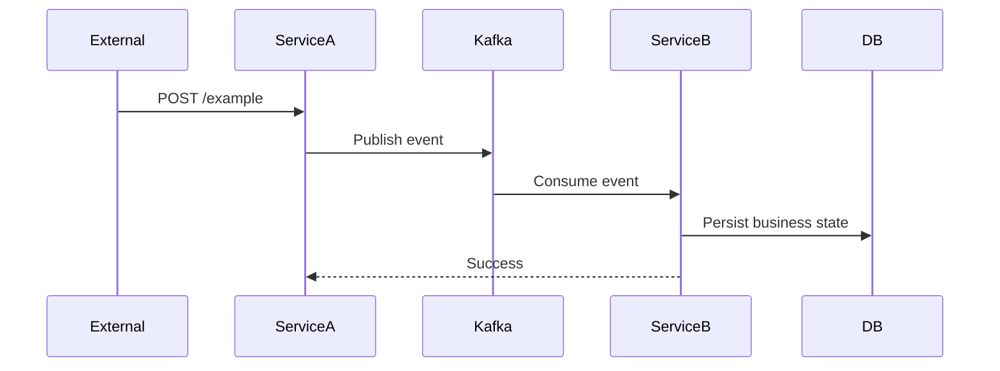
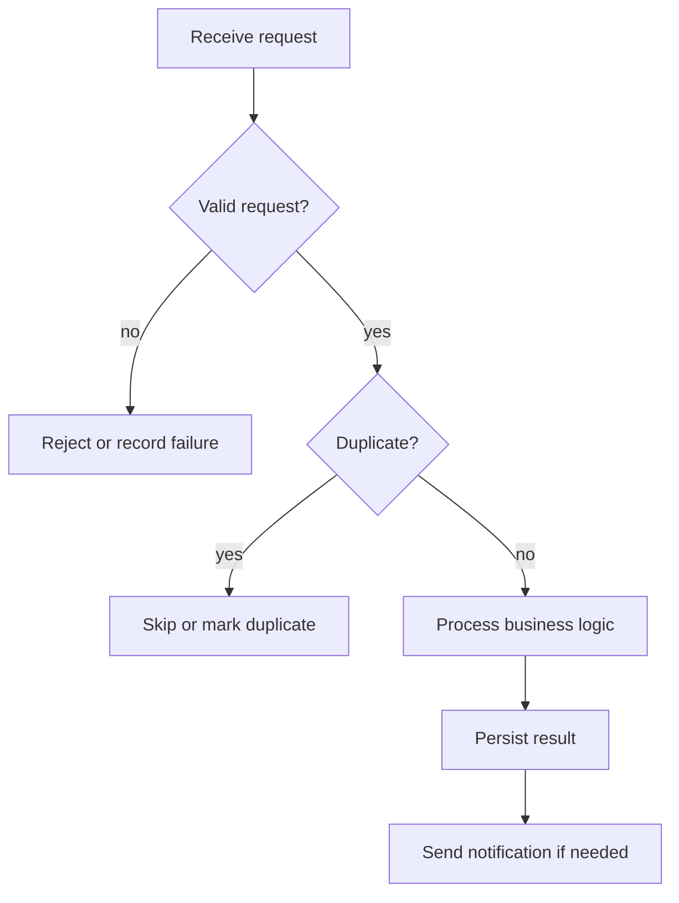

# <Feature / Jira Title> Tech Design

## 1. Related Links

- Jira:
  - <Jira ticket link>
- Requirement / PRD:
  - <Confluence / document link>
- Figma / Prototype:
  - <Figma / prototype link>
- Related Designs:
  - <Related design document link>

## 2. Background

Describe why this work is needed.

- What business problem are we solving?
- How does the current system work?
- Why is the current capability insufficient?
- Which users, systems, or domains are affected?

## 3. Goals

Define what this design must achieve.

- <Goal 1>
- <Goal 2>
- <Goal 3>

## 4. Non-Goals

Define what is intentionally out of scope.

- <Non-goal 1>
- <Non-goal 2>
- <Non-goal 3>

## 5. High-Level Design

Summarize the overall approach.

```text
External System -> service-a -> Kafka -> service-b -> DB / Notification
```

- Request source:
- Involved services:
- Data flow:
- Service ownership:
- Final user/system-visible result:

## 6. System Interaction

### 6.1 Sequence Diagram



### 6.2 Flow Diagram



## 7. API Design

### 7.1 API List

| API | Owner | Purpose | Notes |
|---|---|---|---|
| `POST /xxx` | service-a | External intake | Auth / validation |
| `POST /yyy` | service-b | Internal processing | Business logic |

### 7.2 Request / Response Contract

Specify which API this contract belongs to.

| Field | Required | Purpose | Constraint / Mapping |
|---|---|---|---|
| `id` | Yes | Idempotency key | Must be unique for one event |
| `type` | Yes | Event type | Only supports `<type>` |
| `payload` | Yes | Business payload | Mapped to `<domain object>` |

Response behavior:

- Success:
- Validation failure:
- Duplicate handling:
- Downstream failure:
- Error code / message:

## 8. DB Design

| Collection / Table | Change | Purpose |
|---|---|---|
| `xxx_events` | New / update | Store raw payload and processing status |
| `yyy` | New field / no change | Store business state |

Details:

- New collection / table:
- New fields:
- Index changes:
- Migration:
- Backfill:
- Retention / troubleshooting data:
- Impact on old data:

## 9. Kafka / Async Design

| Topic | Producer | Consumer | Purpose |
|---|---|---|---|
| `xxx-event` | service-a | service-b | Decouple external request from internal processing |

Details:

- Topic name:
- Message contract:
- Producer behavior:
- Consumer behavior:
- Retry behavior:
- Failure behavior:
- Idempotency strategy:
- Reason for async processing:

## 10. Core Business Logic

Describe business behavior instead of implementation diff.

### 10.1 Validation

- <Validation rule 1>
- <Validation rule 2>

### 10.2 Duplicate / Idempotency

- Idempotency key:
- Duplicate behavior:
- Logging / error handling:

### 10.3 State Transition

| Current State / Condition | Action | Result |
|---|---|---|
| <condition> | <action> | <result> |

### 10.4 Business Mapping

| Source Field | Target Field | Rule |
|---|---|---|
| `<source>` | `<target>` | `<mapping rule>` |

### 10.5 Notification

| Condition | Notification | Recipient / Target | Content Source |
|---|---|---|---|
| <condition> | <email / push / banner> | <recipient> | <content source> |

### 10.6 Error Handling

| Error Case | Behavior | Persisted? | Retried? |
|---|---|---|---|
| Invalid request | Reject / log | No | No |
| Downstream failure | Mark failed | Yes | Depends |

## 11. Permission / Auth

- External auth:
- Internal service auth:
- User permission:
- Service account / role:
- Auditing:

## 12. Configuration

| Config | Environment | Value / Source | Purpose |
|---|---|---|---|
| `xxx.secret` | dev / uat / prod | Secret manager | Request authentication |
| `xxx.topic` | all | Kafka config | Async event topic |

Details:

- New config:
- Secret location:
- Default / fallback:
- Feature flag:
- Environment-specific values:
- Initialization data:

## 13. Impact on Existing Features

Describe final product/system impact, not development history.

- API behavior changes:
- UI display changes:
- Enum / category / permission changes:
- Existing flows that remain unchanged:
- Cross-domain impact:
- Backward compatibility:

## 14. Test Plan

Keep this at key acceptance-case level.

| Case | Expected Result |
|---|---|
| Happy path | Creates expected business object and notification |
| Unsupported input | Does not create business object and records/logs reason |
| Duplicate event | Does not create duplicate business object |
| Downstream failure | Marks failure or retries according to design |
| Missing config | Uses fallback or fails clearly |

Suggested coverage:

- Happy path
- Unsupported / invalid input
- Duplicate / idempotency
- State transition
- Notification
- Config missing / fallback
- UI / portal display

## 15. How to Test

Manual verification steps.

Environment:

- dev:
- uat:
- prod:

API example:

```bash
curl --location '<endpoint>' \
  --header 'Content-Type: application/json' \
  --data '{
    "id": "example-id"
  }'
```

Expected result:

- DB:
- Logs:
- UI:
- Notification:
- Downstream system:

## 16. Rollout / Deployment Plan

- Deployment order:
- Config rollout:
- Kafka topic creation:
- DB migration:
- Backfill:
- Feature flag:
- Monitoring:
- Rollback:

## 17. Open Questions / Assumptions

### Assumptions

- <Assumption 1>
- <Assumption 2>

### Open Questions

- <Question 1>
- <Question 2>
