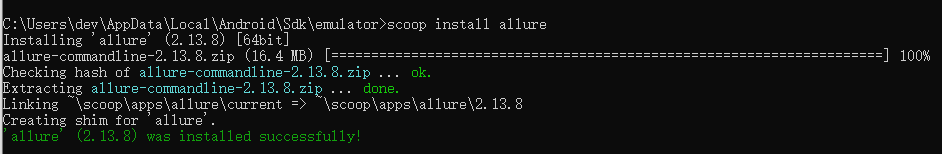
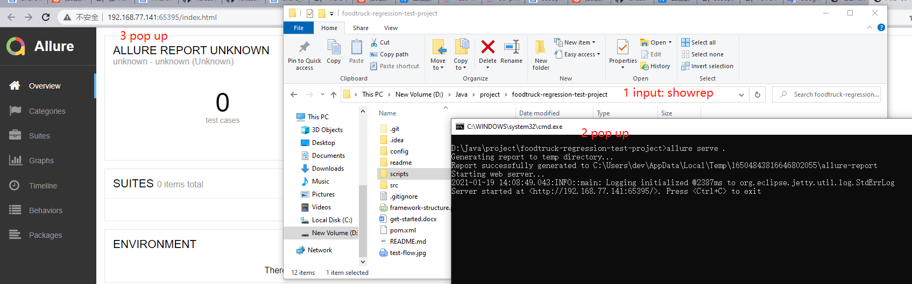
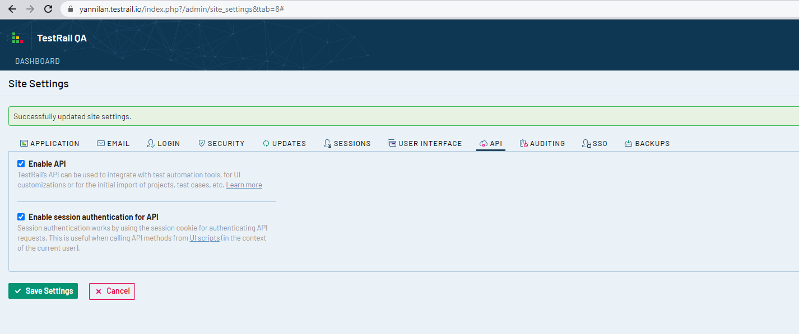

[toc]

# 入门教程

https://zhuanlan.zhihu.com/p/114787270


# project repo 

1. `appium-junit` repo

   ```
   git@github.com:food-truck/foodtruck-regression-test-project.git
   jdk: 1.8
   maven: 3+
   ```

2. `BO-API-util` repo

   ```
   git@github.com:food-truck/BO-API-util.git
   jdk: 15
   maven: 3+
   ```

3. `test-server` repo

   ```
   git@github.com:food-truck/app-test-server-project.git
   jdk: 15
   gradle: 6+
   ```

4. `wonder-app` repo

   ```
   git@github.com:food-truck/foodtruck-wonder-app.git
   ```

# environment 

## for Window

>  工具
> **Android studio、Intellij IDEA、Node、JDK1.8、Appium、Allure、TestRail、scoop**

1. android studio

   - download:  https://developer.android.com/studio
   - 作用: android simulator

   ```
   环境变量设置
   ANDROID_HOME = C:\Users\dev\AppData\Local\Android\Sdk
   ANDROID_SDK_HOME = C:\Users\dev\AppData\Local\Android\Sdk
   ANDROID_AVD_HOME = C:\Users\dev\.android\avd （default）
   path = path + %ANDROID_HOME%\tools + %ANDROID_HOME%\platform-tools
   
   安装检查
   open cmd,input followed:
   > adb        
   > android   
   
   other command
   > cd ANDROID_HOME/emulator
   > emulator -list-avds
   ```

2. appium  

   - `appium desktop` or `appium`

   - url：https://github.com/appium/appium-desktop/releases/tag/v1.19.1）

   - 作用：操作模拟器或真机

```
一个appium 端口只能服务于一个模拟器或真机
```

3. allure

   - url：https://v.youku.com/v_show/id_XNTAyNDEyNjk3Mg==.html

   - 作用：处理测试报告

```
安装前准备
install scoop
open powerShell(admin)
> iwr -useb get.scoop.sh | iex 
env config
> $env:SCOOP='C:\Users\dev\scoop'
> [Environment]::SetEnvironmentVariable('SCOOP', $env:SCOOP, 'User')
> $env:SCOOP_GLOBAL='C:\ProgramData\SCOOP'
> [Environment]::SetEnvironmentVariable('SCOOP_GLOBAL', $env:SCOOP_GLOBAL, 'Machine')

test on cmd
> scoop 

安装allure
open cmd
> scoop install allure
```

	-  效果和使用截图	







4. `test rail` 

   - 注：新建账号，启用API，不需要创建testrail  project

   ```
   Address: https://yannilan.testrail.io/
   Username: 851059946@qq.com
   Password: mKSjv0qgWIYvTww5Baic
   ```

   - 启用API setting

   

   

## for Mac

> 工具：
>
> **Node 、Appium、Allure、 Xcode、Android Studio、Intellij IDEA、JDK1.8**

1. 工具安装

   - Xcode  --Version 12.4 (download from App Store)
   - Android studio 
   - Intellij IDEA

   - 命令行安装

   ```sh
   brew install node
   node -v
   npm -v
   
   npm install -g appium
   appium -v
   npm install -g appium-doctor
   appium-doctor --version
   
   brew install allure
   allure --version
   ```

2. 环境变量设置

   ```sh
   vi ~/.bash_profile
   source ~/.bash_profile
   ```

   ```shell
   # android sdk env setting on bash_profile
   export ANDROID_HOME=/Users/lyn/Library/Android/sdk
   export ANDROID_SDK_HOME=/Users/lyn/Library/Android/sdk
   export ANDROID_AVD_HOME=/Users/lyn/.android/avd
   export PATH=$PATH:$ANDROID_HOME/platform-tools
   
   #jdk1.8 env setting on bash_profile
   export JAVA_HOME=/Library/Java/JavaVirtualMachines/jdk1.8.0_191.jdk/Contents/Home
   export CLASSPATH=$JAVA_HOME/lib/tools.jar:$JAVA_HOME/lib/dt.jar
   export PATH=$PATH:$JAVA_HOME/bin
   ```


# Wonder app 打包（ipa）

- 系统：OS
- 软件：Xcode
- 其他环境安装

```
brew install node
brew install yarn
brew install ruby

sudo gem install cocoapods
cd $appDir/ios
pod install --verbose --no-repo-update
```

- 注：打包需要Apple开发者证书（https://developer.apple.com）


# AppCenter

- https://appcenter.ms/apps

```
appcenter test run appium --app "Food-Truck-Inc/wonder-ios-uat" --devices "Food-Truck-Inc/devicesample-2020-dot-05-dot-14" --app-path D:\app\wonder.ipa --test-series "master" --locale "en_US" --build-dir target/upload

--app "Food-Truck-Inc/wonder-ios-uat" (wonder app)
--devices "Food-Truck-Inc/devicesample-2020-dot-05-dot-14" （appcenter 上选中用来测试的设备机系列）
-app-path D:\app\wonder.ipa （重点：需要测试的包所在地址）
--test-series "master" （代码分支）
--locale "en_US" （语言）
--build-dir target/upload （重点：）
```


