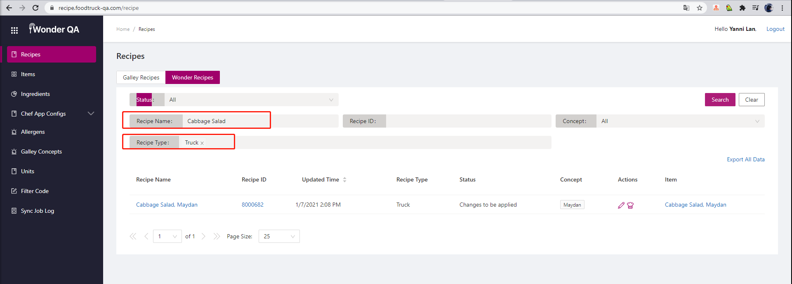

[toc]

# 入门教程

https://zhuanlan.zhihu.com/p/114787270


# project repo & environment

1. `appium-junit` repo

   ```
   git@github.com:food-truck/foodtruck-regression-test-project.git
   jdk: 1.8
   maven: 3+
   ```

2. `BO-API-util` repo

   ```
   git@github.com:food-truck/BO-API-util.git
   jdk: 15
   maven: 3+
   ```

3. `test-server` repo

   ```
   git@github.com:food-truck/app-test-server-project.git
   jdk: 15
   gradle: 6+
   ```

4. `wonder-app` repo

   ```
   git@github.com:food-truck/foodtruck-wonder-app.git
   ```

# tool 

## for Window

1. android studio

   - download:  https://developer.android.com/studio
   - 作用: android simulator

   ```
   环境变量设置
   ANDROID_HOME = C:\Users\dev\AppData\Local\Android\Sdk
   ANDROID_SDK_HOME = C:\Users\dev\AppData\Local\Android\Sdk
   ANDROID_AVD_HOME = C:\Users\dev\.android\avd （default）
   path = path + %ANDROID_HOME%\tools + %ANDROID_HOME%\platform-tools
   
   安装检查
   open cmd,input followed:
   > adb        
   > android   
   
   other command
   > cd ANDROID_HOME/emulator
   > emulator -list-avds
   ```

   

2. appium desktop

   - url：https://github.com/appium/appium-desktop/releases/tag/v1.19.1）

   - 作用：操作模拟器或真机

```
一个appium 端口只能服务于一个模拟器或真机

```

3. allure

   - url：https://v.youku.com/v_show/id_XNTAyNDEyNjk3Mg==.html

   - 作用：处理测试报告

```
安装前准备
install scoop
open powerShell(admin)
> iwr -useb get.scoop.sh | iex 
env config
> $env:SCOOP='C:\Users\dev\scoop'
> [Environment]::SetEnvironmentVariable('SCOOP', $env:SCOOP, 'User')
> $env:SCOOP_GLOBAL='C:\ProgramData\SCOOP'
> [Environment]::SetEnvironmentVariable('SCOOP_GLOBAL', $env:SCOOP_GLOBAL, 'Machine')

test on cmd
> scoop 

安装allure
open cmd
> scoop install allure


```

	-  效果和使用截图	


4. `test rail` 

   - 注：新建账号，启用API，不需要创建testrail  project

   ```
   Address: https://yannilan.testrail.io/
   Username: 851059946@qq.com
   Password: mKSjv0qgWIYvTww5Baic
   ```

   - 启用API setting

   

   

## for Mac

- see other document

# `appium-junit` 项目操作手册

## 03 

1. devices.properties

```properties
#Example: android10=[pixel3@10.0] It's suggested to use AVD_NAME for emulator which could be found by command: "%ANDROID_SDK_HOME%/emulator/emulator --list-avds"
#Example: ios13=[iPhone 11@13.3] The device name should match Simulator or real device name for appium to match the device
android11=[Pixel_3_11@11.0]
```

2. setting.properties

```properties
android.appiumServer=127.0.0.1
android.appPathOnServer=
localAndroid.profile=profiles/localAndroidProfile.properties
ios.appiumServer=127.0.0.1
iosSimulator.appPathOnServer=
iosRealDevice.appPathOnServer=
localIOS.profile=profiles/localIOSProfile.properties
localDebugMode=false
device.default=android10
appCenter.profile.format=profiles/appCenterProfile-%d.properties
env=uat
testRailEnabled=false
reportRootFolderName=result
localRepeatFailed=true
```

## 04

- setting.properties


class EmlxAttachmentExtractor : 导出邮件	


# account

Mac mini

```
TeamViewer: 445898038:ct2test
```

```
appcenter test run appium --app "Food-Truck-Inc/wonder-ios-uat" --devices "Food-Truck-Inc/devicesample-2020-dot-05-dot-14" --app-path D:\app\wonder.ipa --test-series "master" --locale "en_US" --build-dir target/upload

--app "Food-Truck-Inc/wonder-ios-uat" (wonder app)
--devices "Food-Truck-Inc/devicesample-2020-dot-05-dot-14" （appcenter 上选中用来测试的设备机系列）
-app-path D:\app\wonder.ipa （重点：需要测试的包所在地址）
--test-series "master" （代码分支）
--locale "en_US" （语言）
--build-dir target/upload （重点：）
```


# data init




