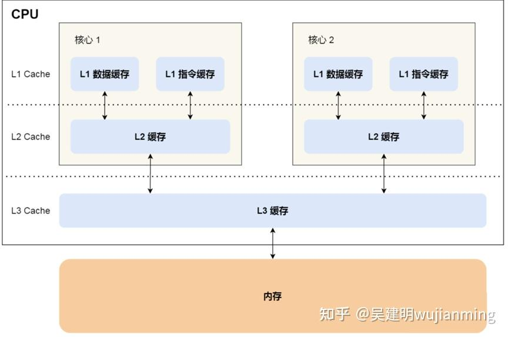
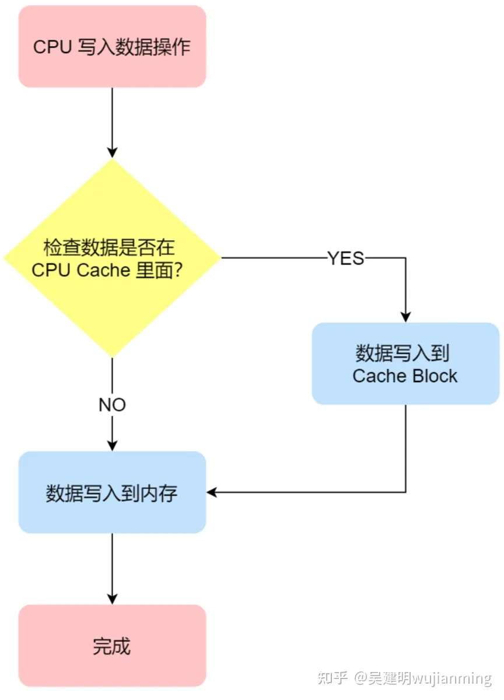

# CPU三级缓存

<https://zhuanlan.zhihu.com/p/461548456>

为什么需要cache?

```
提高访问速度：高速缓存将最常访问的数据和指令存储在靠近处理器的快速存储器中。由于缓存的访问速度比主存储器快得多，处理器可以更快地获取所需的数据和指令，从而加快计算机系统的运行速度。

减少延迟：主存储器的访问延迟比处理器的时钟周期长得多。通过使用高速缓存，处理器可以更频繁地从快速存储器中获取数据，减少了对主存储器的直接访问，从而降低了延迟。

提高局部性：计算机程序具有局部性原理，即程序往往会多次访问相同的数据或指令，或者访问相邻的数据或指令。高速缓存利用局部性原理，将最常访问的数据和指令存储在缓存中，提高了命中率，减少了对主存储器的访问次数。

缓解内存带宽压力：主存储器的带宽是有限的，处理器对主存储器的并发访问可能会导致带宽瓶颈。通过使用高速缓存，处理器可以通过更频繁地访问缓存来减少对主存储器的访问需求，缓解了内存带宽的压力。

节约能源：高速缓存的访问速度比主存储器快，因此处理器可以更快地完成所需的操作并进入空闲状态，从而减少了处理器的工作时间，节约了能源消耗。
```

cpu cache 有多快?


什么是 CPU Cache？

```
 CPU Cache，也称高速缓存，通常分为大小不等的三级缓存，分别是 L1 Cache、L2 Cache 和 L3 Cache。其中L3是多个核心共享的。

```
程序加载数据的流程：内存->L3->L2>L1。（越靠近 CPU 核心的缓存其访问速度越快）


什么是Cache Line?

```
Cache Line（缓存行）是高速缓存中的基本单位，用于存储从主存储器中复制的数据块。它是一块连续的内存区域，通常具有固定的大小，通常是2的幂次方大小的字节。

结构：Cache Line 是由各种标志(Tag)+ 数据块(Data Block)组成。
```

cpu cache 读取过程

cpu cache数据的写入

”写直达“
```
流程：如果数据已经在 Cache 里面，先将数据更新到 Cache 里面，再写入到内存里面; 如果数据没有在 Cache 里面，就直接把数据更新到内存里面。


缺点：
写直达法很直观，也很简单，但是问题明显，无论数据在不在 Cache 里面，[每次写操作都会写回到内存]， 这样写操作将会花费大量的时间，无疑性能会受到很大的影响。

优点：

```


写回

。。。


如何保持数据一致性？

写传播

事务的串形化
```

```

**MESI协议**：Modify Exclusive Shared Invalid

**虚拟地址**

虚拟寻址需要硬件与操作系统之间互相合作。CPU中含有一个被称为内存管理单元（Memory Management Unit, MMU）的硬件，功能是将虚拟地址转换为物理地址。MMU需要借助存放在内存中的页表来动态翻译虚拟地址，该页表由操作系统管理。

