[toc]

# 开发前须知

## git源码 

https://github.com/wso2-extensions/esb-connector-dayforce/blob/master/docs/employeeEmploymentInformation/employeeEmploymentTypes.md#retrieving-employee-employment-types


## 开发文档

https://developers.dayforce.com/Special-Pages/Registration.aspx 

https://developers.dayforce.com/Special-Pages/Logon.aspx

https://developers.dayforce.com/Build/API-Explorer/Employee-Employment-Information/Employment-Types/GET-Employee-Employment-Types.aspx


## 管理工具

https://wso2.com/integration/integration-studio/


## dayforce后台

```
https://usconfigr58.dayforcehcm.com/mydayforce/login.aspx

```

# 项目分析

## **dayforce-service**

作用：

1、应用kafka订阅员工 排班变更信息，再使用sftp 将 员工排班变更信息 上传给dayforce。（数据来源：shift-schedule）

2、启用job任务 ，（自己发布自己订阅）

​	自己发布：触发kafka发布 指定时间范围内 需要去获取的员工信息、balabala等

​	自己订阅：从dayforce获取相关数据， upsert 到 comos db（数据存放位置：employee-service）

## **employee-service**

作用：

1、操作cosmos db中的员工信息

## **shift-schedule-service**

作用：

1.1、应用kafka发布员工 排班**变更**消息(fill、cancel) 到dayforce-service，并且将保存到cosmos db

1.2、应用kafka发布员工 排班**变更**信息(fill、unfill ) 给truck-service 

2、使用kafka订阅卡车排班信息，将数据保存到 cosmos db。（数据来源：truck-service）

3、ChangeFeedProcessor是啥？？？

## **shift-schedule-site**

作用：

1、网页端展示数据用

## **shift-solver-service**

作用：

1、将卡车排班信息和员工有效信息进行匹配，生成完整的排班信息

问题：

哪个地方在调用（/bo/shiftsolver/solve put）这个接口？？？


## **backend:schedule-service**

作用：

1、job1: 把dayforce上的employee数据更新到cosmos db。

2、job2 : 把dayforce上的EmployeeAvailability数据更新到 cosmos db。


# 问题

### 问题描述：获取可用员工失败


```
获取可用管理员
	shiftId :"2343b490-c070-438e-8f64-7922c44485e3" 
    "startTime": 1598524200000,  2020/8/27 18:30:00 -4h 
    "endTime": 1598538300000,  2020/8/27 22:25:0 -4h
    truckSessionId : 4571
    
SELECT DISTINCT a.id FROM employee_availability a JOIN t IN a.timeWindow WHERE t.startTime <= 1598524200000 AND t.endTime >= 1598538300000
 
=>   ["5000","5001","5002","5003","5004"]
    
select * from c where c.employmentStatus = "ACTIVE" and ARRAY_CONTAINS([], c.id) and c.entitlement.isShiftManager = true

=>[
    {
        "id": "5004",
        "firstName": "Test",
        "lastName": "Five",
        "emailAddress": "test5@rf.com",
        "phone": "512 555 5555",
        "address": [
            "123 Test Lane",
            "New York, NY 10001, USA"
        ],
        "employmentStatus": "ACTIVE",
        "payType": "Full Time",
        "position": "Fleet - COR Driver",
        "skills": [
            "KIDSMENU",
            "FRANKIES"
        ],
        "gender": "F",
        "entitlement": {
            "isAdmin": false,
            "isShiftManager": true,
            "updatedBy": "sage"
        },
        "weeklyHours": 40,
        "baseRate": 20,
        "eligibilityChanged": true,
        "_rid": "Dc5FANygEhF-BAAAAAAAAA==",
        "_self": "dbs/Dc5FAA==/colls/Dc5FANygEhE=/docs/Dc5FANygEhF-BAAAAAAAAA==/",
        "_etag": "\"11004c16-0000-0100-0000-5f3fc5020000\"",
        "_attachments": "attachments/",
        "_ts": 1598014722
    }
]

北京时间     utc时间戳
2020-08-24 1598198400000
2020-08-31 1598803200000

----查看员工的可用时间范围对

SELECT  a.id, TimestampToDateTime(t.startTime) st, TimestampToDateTime(t.endTime) et  FROM employee_availability a JOIN t IN a.timeWindow WHERE a.id = "5004" AND (t.startTime >= 1598198400000 AND t.startTime < 1598803200000 
OR t.startTime <= 1598198400000 AND t.endTime >= 1598198400000
OR t.endTime >= 1598198400000 AND t.endTime <= 1598803200000 )
= 
SELECT a.id, TimestampToDateTime(t.startTime) st, TimestampToDateTime(t.endTime) et  FROM employee_availability a JOIN t IN a.timeWindow WHERE a.id = "5004" AND (t.startTime >= 1598198400000 AND t.startTime < 1598803200000 
OR t.startTime <= 1598198400000 AND t.endTime >= 1598198400000)

=> [
    {
        "id": "5004",
        "startTime": 1598155200000,
        "endTime": 1598241600000
    },
    {
        "id": "5004",
        "startTime": 1598241600000,
        "endTime": 1598328000000
    },
    {
        "id": "5004",
        "startTime": 1598328000000,
        "endTime": 1598414400000
    },
    {
        "id": "5004",
        "startTime": 1598414400000,
        "endTime": 1598500800000
    },
    {
        "id": "5004",
        "startTime": 1598500800000,
        "endTime": 1598587200000
    },
    {
        "id": "5004",
        "startTime": 1598587200000,
        "endTime": 1598673600000
    },
    {
        "id": "5004",
        "startTime": 1598673600000,
        "endTime": 1598760000000
    },
    {
        "id": "5004",
        "startTime": 1598760000000,
        "endTime": 1598846400000
    }
]

北京时间     utc时间戳
2020-08-24 1598198400000
2020-08-31 1598803200000

st >= startTime && st <= endTime || st <= startTime && et >= startTime
st
et
1598155200000	2020-08-23  12:00:00
1598241600000	2020-08-24  12:00:00
1

1598241600000	2020-08-24  12:00:00
1598328000000	2020-08-25  12:00:00
1	
1598328000000	2020-08-25  12:00:00
1598414400000	2020-08-26  12:00:00
	
1598414400000	2020-08-26  12:00:00
1598500800000	2020-08-27  12:00:00
	
1598500800000	2020-08-27  12:00:00
1598587200000	2020-08-28  12:00:00
	
1598587200000	2020-08-28  12:00:00
1598673600000	2020-08-29  12:00:00
	
1598673600000	2020-08-29  12:00:00
1598760000000	2020-08-30  12:00:00
   	 
1598760000000	2020-08-30  12:00:00
1598846400000	2020-08-31  12:00:00


gridStartTime >= employeeAvailableStartTime && gridStartTime <= employeeAvailableEndTime
                        || gridStartTime <= employeeAvailableStartTime && gridEndTime >= employeeAvailableStartTime
                        || gridEndTime >= employeeAvailableStartTime && gridEndTime <= employeeAvailableEndTime
                                  
                        
                        
 long employeeAvailableStartTime = json.get("startTime").asLong();
                long employeeAvailableEndTime = json.get("endTime").asLong();
                timeWindows.stream().filter(p -> {
                    var gridStartTime = p.startTime.toInstant().toEpochMilli();
                    var gridEndTime = p.endTime.toInstant().toEpochMilli();
                    return gridStartTime >= employeeAvailableStartTime && gridStartTime <= employeeAvailableEndTime
                        || gridStartTime <= employeeAvailableStartTime && gridEndTime >= employeeAvailableStartTime
                        || gridEndTime >= employeeAvailableStartTime && gridEndTime <= employeeAvailableEndTime;
```

问题： 列表上展示的是27号创建的shift , availability 黄方框部分应为黄色

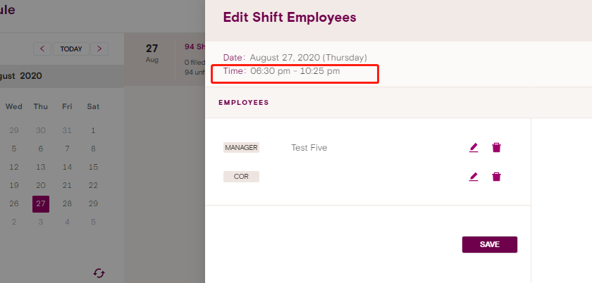

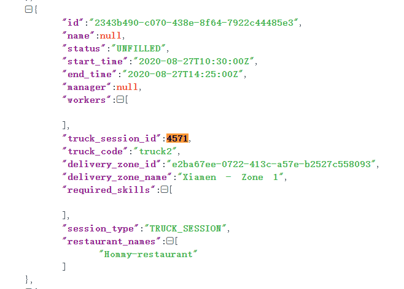,endDate=[nextDay,nextDay+30)}
默认值：startDate={} endDate={}
average_hours_for_full_time 【average_hours_for_full_time】
average_hours_for_part_time 【average_hours_for_part_time】
Total Shift Duration：总时间成本（四舍五入）【total_shift_duration】
Total Labor Cost：总人工成本【total_wage_cost】
Number of Shift Assignments【number_of_shift_assignments】
Total COR Shifts：cor类型的shift数量【total_cor_shifts】
Total ROAR Shifts：rora类型的shift数量 【total_roar_shifts】
Total Training Shifts: training类型的shift数量 【total_training_shifts】
Total Other Shifts: other类型是shift数量 【total_other_shifts】
Excluded Employees:可以被分配但是没有被分配的员工数量【excluded_employees】
Excluded Shifts: 在当前日期范围没有被排满的shift【excluded_shifts】

Excluded Employees :【excluded_employees】
Excluded Shifts ：【excluded_shifts】


when objective = "Minimize Wages Paid"
- dailyMaxHours = 10 ?
- time_limit = 5 ?
-- 答：取默认值

when objective = "Maximize Participation"
- dailyMaxHours = 10 ?
- time_limit = 5 ?
-- 答：取默认值


preview第三列只展示filled的数据吗？还是包括unFilled的shift数据？

average_hours_for_full_time 和average_hours_for_part_time 这两个字段根据什么计算？

注 ：
所有的total都是dateRange;
solver只对truckSession类型的shift进行排班:
- 每个shift只分配一个worker 
- 没有对manager进行排班

第三列shift 只展示filled之后的数据
	

问题1：
average_hours_for_full_time= ? 当前时间范围内参与排班的员工（full time 类型） 的工作时长 累加/当前时间范围内shift总持续时长
average_hours_for_part_time= ? 当前时间范围内参与排班的员工（part time 类型） 的工作时长 累加/当前时间范围内shift总持续时长

```

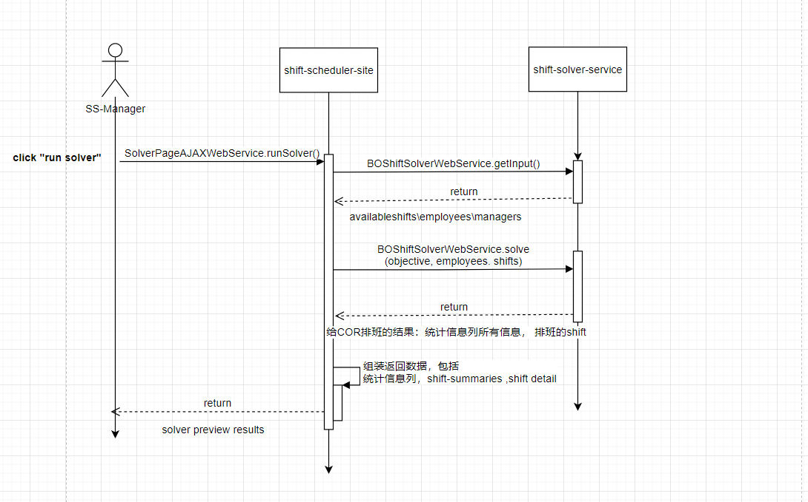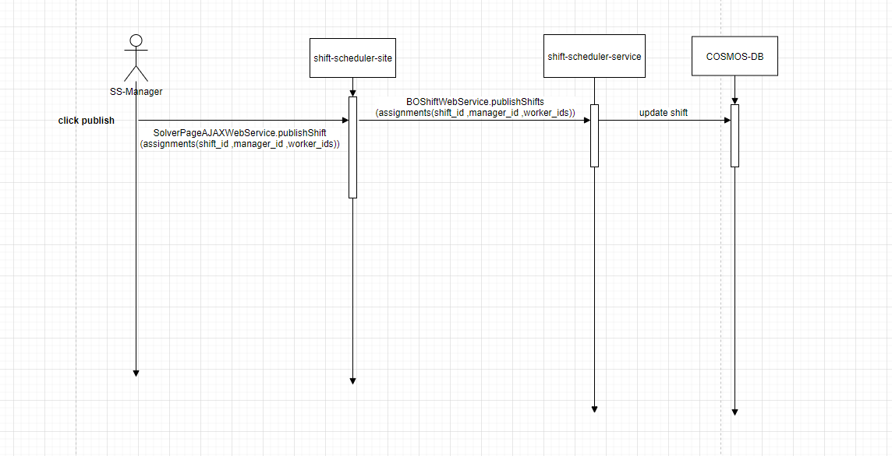


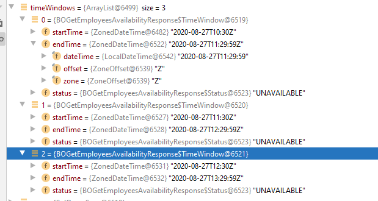


```

2020-08-24 00:00:00
2020-08-31 00:00:00

SELECT c.id FROM shifts c JOIN w IN c.shiftWorkers WHERE (w.employeeId = "5004" OR c.shiftManager.employeeId = "5004") AND (c.startTime >= @startTime AND c.startTime < @endTime OR c.startTime <= @startTime AND c.endTime >= @startTime)
=>
shiftId : 819a8d93-bf68-4cb1-a351-71499d068dae 
truckSessionId : 4639
不符合逾期 少一条数据:2343b490-c070-438e-8f64-7922c44485e3

=>更新sql 
SELECT c.id FROM shifts c where (ARRAY_CONTAINS (c.shiftWorkers,{"employeeId":"5004"},true) or c.shiftManager.employeeId = "5004")
AND (c.startTime >= 1598227200000 AND c.startTime < 1598832000000 OR c.startTime <= 1598227200000 AND c.endTime >= 1598227200000)

[
    {
        "id": "4b99266b-7531-45c9-9f4f-e47d91b43565"
    },
    {
        "id": "65361eaa-df20-4ed8-8275-016e2ffa072d"
    },
    {
        "id": "3f0125e8-db12-48c8-b9b9-872c75f8c550"
    },
    {
        "id": "1cfae800-656a-482f-8784-a0a93d27a827"
    },
    {
        "id": "e289cf62-18e6-4ece-964a-c72fa7492470"
    },
    {
        "id": "e0832fb5-8e03-484f-9ad0-4adf2b8409c0"
    },
    {
        "id": "644b3106-869f-453c-a7ab-b3ea4fd00317"
    },
    {
        "id": "a26906ad-c217-4910-8423-678d40db03b6"
    },
    {
        "id": "819a8d93-bf68-4cb1-a351-71499d068dae"
    },
    {
        "id": "8e300548-4197-4743-9db9-cadb49376db8"
    }
]
```

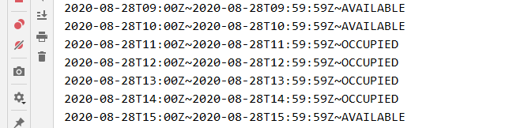

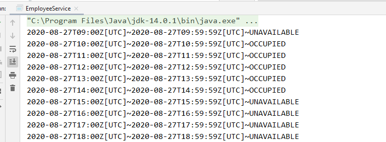


### 问题描述：不能获取到可用的worker 或者manager

```
issue http://120.77.208.172:8080/browse/FT-8042 
shiftId : 4ee54f5f-7885-4b47-878a-dc16b1983925
startTime 1598931000000 2020-09-01T03:30:00.0000000Z
endTime 1599022500000 2020-09-02T04:55:00.0000000Z

SELECT DISTINCT a.id FROM employee_availability a JOIN t IN a.timeWindow WHERE t.startTime <= 1598931000000 AND t.endTime >= 1599022500000
=> null

select * from c where c.employmentStatus = "ACTIVE" and ARRAY_CONTAINS(["10067"], c.id) and c.position = "Fleet - COR Manager"
=> []

SELECT DISTINCT a.id ,TimestampToDateTime(t.startTime) st ,TimestampToDateTime(t.endTime ) et FROM employee_availability a JOIN t IN a.timeWindow WHERE t.startTime >= 1599062400000   

SELECT DISTINCT a.id ,(t.startTime) st ,(t.endTime ) et FROM employee_availability a JOIN t IN a.timeWindow WHERE t.startTime >= 1599062400000   

1599105600000 1599192000000
SELECT DISTINCT a.id FROM employee_availability a JOIN t IN a.timeWindow WHERE t.startTime <= 1599105600000 AND t.endTime >= 1599192000000
=> [
    {
        "id": "5000"
    },
    {
        "id": "5001"
    },
    ....
   ]
select * from c where c.employmentStatus = "ACTIVE" and ARRAY_CONTAINS(["5000"], c.id) and c.position = "Fleet - COR Driver"


```

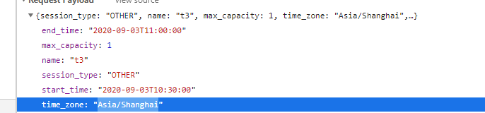


### 问题描述：不能给trucksession类型是shift分配cor

```
shiftId : 3ab4e672-00cd-4792-bdb5-1795ee9ddb0a 
Truck Session ID: 4740
644ec7cd-285b-48ae-b3d4-f4512d49001a

1. select shift information according to shiftId=3ab4e672-00cd-4792-bdb5-1795ee9ddb0a 
select c.id , TimestampToDateTime(c.startTime) st ,TimestampToDateTime(c.endTime) et , c.startTime,c.endTime, c.mustIncludeSkills from c where c.id="3ab4e672-00cd-4792-bdb5-1795ee9ddb0a"
=>
[
    {
        "id": "3ab4e672-00cd-4792-bdb5-1795ee9ddb0a",
        "st": "2020-09-02T04:30:00.0000000Z",
        "et": "2020-09-03T05:55:00.0000000Z",
        "startTime": 1599021000000,
        "endTime": 1599112500000,
        "mustIncludeSkills": [
            "TESTSKILL"
        ]
    }
]
2. add data to employee_availability
SELECT DISTINCT a.id FROM employee_availability a JOIN t IN a.timeWindow WHERE t.startTime <= 1599487200000 AND t.endTime >= 1599494400000
{
    "id": "YanniaLan",
    "timeWindow": [
        {
            "startTime": 1599021000000,
            "endTime": 1599112500000
        }
    ]
}

3. add skill to employees table
{
	"id": "YanniaLan",
    "skills": [
        "Botanica ", "TESTSKILL"
    ]
}

4. result : Available employees can be obtained in UI

```

结果

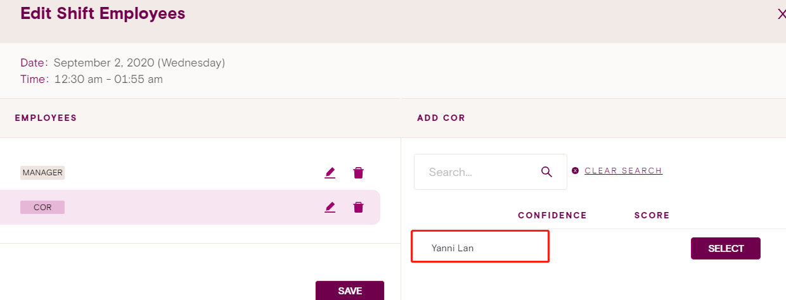


> service

```
shift-scheduler-site 8443

shift-scheduler-service 8445
empoloyee-service 8444
shift-solver-service 8446
truck-service 8447
 -Dcore.webPath=D:\Java\project\foodtruck-project\shift\shift-scheduler-site\src\main\dist\web
 
 test
 
 1. select c, TimestampToDateTime(c.startTime), TimestampToDateTime(c.endTime) from shift c where c.sessionType="TRUCK_SESSION" and c.status="UNFILLED" order by c._ts desc
 
 shift
 3ab4e672-00cd-4792-bdb5-1795ee9ddb0a 
 utc 
 st 1599177600000 2020-09-04
 et 1599264000000 2020-09-05
 
 
 fb7a1aec-c9a9-4b9f-a667-ea135e2698b0
 
```


```
   
       public static void main(String[] args) {
        RunSolverAJAXResponse.Shift shift = new RunSolverAJAXResponse.Shift();
        shift.startTime = ZonedDateTime.now(ZoneId.of("UTC"));
        shift.endTime = shift.startTime.plusDays(1);
        shift.workers = List.of();
        shift.status = RunSolverAJAXResponse.ShiftStatus.FILLED;
        List<RunSolverAJAXResponse.Shift> shiftAssignments = List.of(shift);

        List<RunSolverAJAXResponse.Shift> shifts = acrossDaysAndFilledShifts(shiftAssignments, "UTC");
        shifts.forEach(item -> {
            System.out.println(item.planDate);
        });
    }
```


### 问题描述：solver 统计信息计算

```
utc 
2020-09-07 1599436800000
2020-09-10 1599696000000
select * from c where c.startTime<= 1599436800000 and c.endTime >= 1599436800000
```


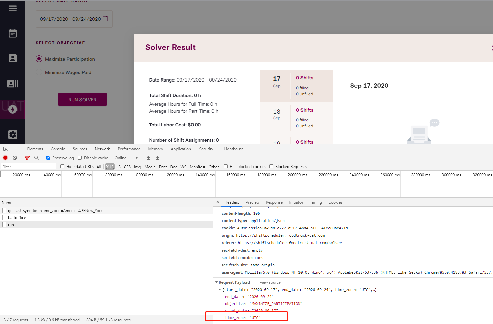


## last_sync_time == null

```
app: "scheduler-service"  and action: "job:sync-employees"  or action:"job:sync-employee-availability"

2020-08-28 FT7644 实现代码 
qa : Sep 4, 2020 @ 09:32:31.273 允许job
uat : Sep 5, 2020 @ 09:39:43
结果：无解
1.该时间段内employee表未开始同步，employee_availability 同步时缺少同步记录值

```

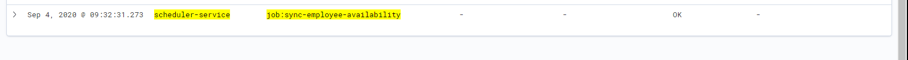


​                                                                                                                                                                                       

## 时间运算

1. 将日期和时间转化成时间戳
2. 按startTime给时间区间排序
3. 多个时间[s1,e1] 、[s2,e2].....
   - 如果e1==s2，那么时间连续的合并成一个区间，即[s1,e2]
4. 建时间戳转化成指定日期格式
5. 


```
   private static TreeMap<Long, Long> mergeTimeRanges(TreeMap<Long, Long> timeRanges) {
        TreeMap<Long, Long> results = new TreeMap<>();
        Map.Entry<Long, Long> last = timeRanges.lastEntry();
        Map.Entry<Long, Long> first = timeRanges.firstEntry();
        Long lastStart = last.getKey();
        Long lastEnd = last.getValue();
        Long preStart = first.getKey();
        Long preEnd = first.getValue();
        for (Map.Entry<Long, Long> next : timeRanges.entrySet()) {
            Long nextStart = next.getKey();
            Long nextEnd = next.getValue();
            if (preStart.equals(nextStart) && preEnd.equals(nextEnd)) {
                if (lastStart.equals(nextStart)) {
                    results.put(nextStart, nextEnd);
                    break;
                }
                continue;
            }
            if (nextStart.equals(preEnd)) {
                preEnd = nextEnd;
            } else {
                results.put(preStart, preEnd);
                preStart = nextStart;
                preEnd = nextEnd;
            }
            if (lastStart.equals(nextStart) && lastEnd.equals(nextEnd)) {
                results.put(preStart, nextEnd);
                break;
            }
        }
        return results;
    }
```


```
Successfully authenticated for user wonderqa
Session Id = wonder:c080077e-7bd3-4652-bd67-f025d8a35111
Query Governer Setting (Maximum number of rows allowed): 1000
```

### cosmos时间存储


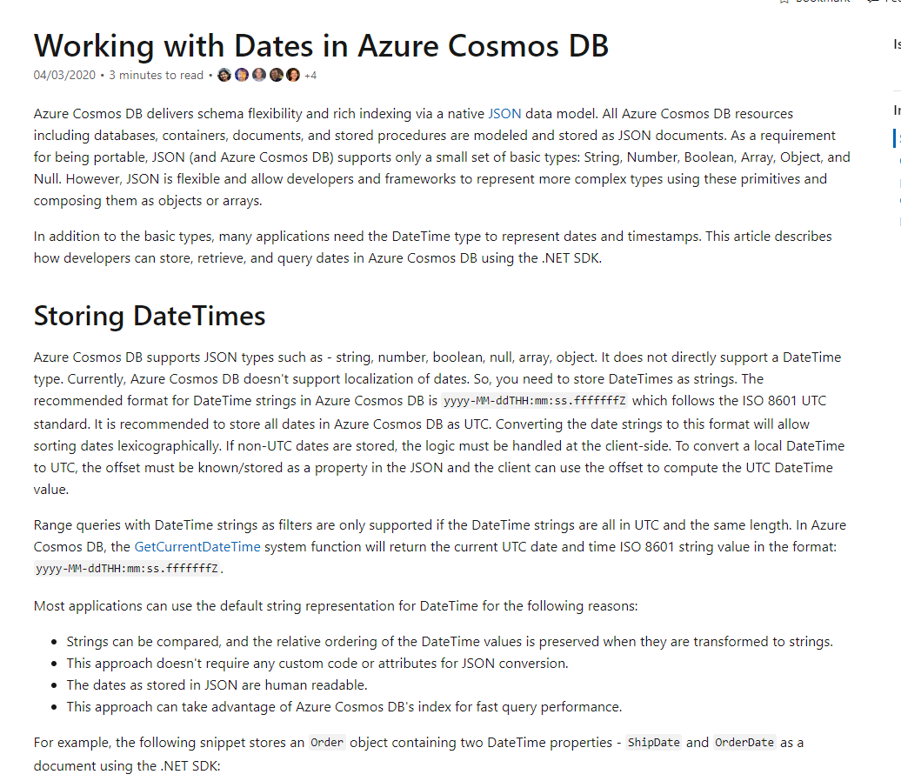


星期一：

前期：与导师商榷、设计可行性方案；

后期：

1. 等待转换dayforce数据测试用例，修复bug，issue（http://120.77.208.172:8080/browse/FT-8254、http://120.77.208.172:8080/browse/FT-8230）
2. 排查实时反馈的bug

星期二：

写代码实现dayforce数据转换、review、等下一步的测试用例

分析：

1. 预测难度低

2. 并没有把全部时间投入8257

   

## 可选时间范围校验（未来30天）

```
public static void main(String[] args) {
    LocalDate startDate = LocalDate.parse("2020-09-10");
    LocalDate endDate = LocalDate.parse("2020-10-09");
    String timeZone = "Asia/Shanghai";
    checkDateRange(startDate, endDate, timeZone);//suc
    checkDateRange(startDate, endDate.plusDays(1), timeZone);//fail
    checkDateRange(startDate.minusDays(1), endDate, timeZone);//fail
    checkDateRange(startDate.plusDays(1), endDate, timeZone);//true
    checkDateRange(startDate.plusDays(1), endDate.minusDays(1), timeZone);//true
}
```

## 时间转换

https://docs.microsoft.com/en-us/azure/cosmos-db/sql-query-datetimefromparts


## summary 

http://120.77.208.172:8080/browse/FT-8323

http://120.77.208.172:8080/browse/FT-8435

http://120.77.208.172:8080/browse/FT-8291


> ## truck-service => shift

```
1. 创建trucksession, 通过kafak将数据发送到shift

```

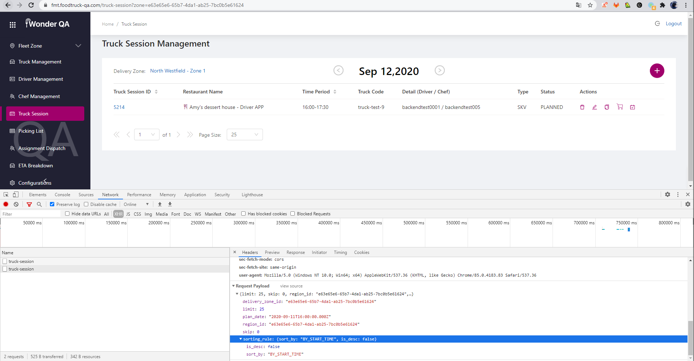

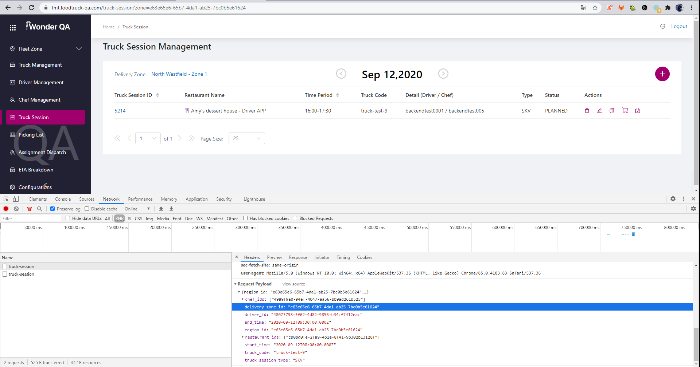


```
in shift-scheduler-site layer:
EmployeePageAJAXWebService.getEmployeeAvailability()

in employee-service layer:
EmployeeService.employeesAvailability() 
```


```
in shift-scheduler-site layer:
ShiftPageAJAXWebService.ShiftPageAJAXWebService()
ShiftPageAJAXWebService.findAlternativeWorkers()
ShiftPageAJAXWebService.findAlternativeEmployees()

in employee-service layer:
EmployeeService.getEmployeesByFilter()
 EmployeeService.getEmployeesByAvailability() 改表名即可

```


````
yyyy-MM-ddTHH:mm:ss.fffffffZ

SELECT DISTINCT a.id ,TimestampToDateTime(t.startTime) startTime ,TimestampToDateTime(t.endTime ) endTime FROM employee_availability a JOIN t IN a.timeWindows WHERE t.startTime >= ?

SELECT DISTINCT a.id FROM employee_availability_v2 a JOIN t IN a.timeWindows WHERE t.startTime <= "2020-08-31T04:00:00.0000000Z" AND t.endTime >= "2020-09-10T04:00:00.0000000Z"

SELECT DISTINCT a.id FROM employee_availability_v2 a JOIN t IN a.timeWindows WHERE t.startTime >= "2020-08-19T04:00:00.0000000Z" 
=> [ "5000"]
SELECT DISTINCT a.id FROM employee_availability_v2 a JOIN t IN a.timeWindows WHERE t.startTime >= "2020-08-19T04:00:00Z" 
=> []

SELECT DISTINCT a.id FROM employee_availability_v2 a JOIN t IN a.timeWindows WHERE t.startTime = "2020-08-31T04:00:00.0000000UTC"

````


```
{
    "id": "5000",
    "timeWindows": [
        {
            "startTime": "2020-08-19T04:00:00.0000000Z",
            "endTime": "2020-08-20T04:00:00.0000000Z"
        }
    ],
    "_rid": "Dc5FAPrdBWkBAAAAAAAAAA==",
    "_self": "dbs/Dc5FAA==/colls/Dc5FAPrdBWk=/docs/Dc5FAPrdBWkBAAAAAAAAAA==/",
    "_etag": "\"2a000261-0000-0100-0000-5f58bdbf0000\"",
    "_attachments": "attachments/",
    "_ts": 1599651263
}
```


```
package app.employee.service;

import app.employee.IntegrationTest;
import app.employee.domain.EmployeeAvailabilityV2;
import com.azure.cosmos.models.SqlParameter;
import com.azure.cosmos.models.SqlQuerySpec;
import core.framework.cosmos.CosmosCollection;
import core.framework.inject.Inject;
import org.junit.jupiter.api.Disabled;
import org.junit.jupiter.api.Test;

import java.time.ZoneId;
import java.time.ZonedDateTime;
import java.time.format.DateTimeFormatter;
import java.util.List;
import java.util.stream.Collectors;

/**
 * @author Yanni
 */
@Disabled
public class SqlTest extends IntegrationTest {
    @Inject
    CosmosCollection<EmployeeAvailabilityV2> employeeAvailabilityCollection;

    @Test
    void getEmployeesByAvailabilityV21() {
        String format = "yyyy-MM-dd'T'HH:mm:ss.SSSSSSSZ";
        DateTimeFormatter formatter = DateTimeFormatter.ofPattern(format);
        ZonedDateTime startTime = ZonedDateTime.parse("2020-08-19T04:00:00.0000000Z");
        ZonedDateTime endTime = ZonedDateTime.parse("2020-08-20T04:00:00.0000000Z");
        ZonedDateTime start = ZonedDateTime.ofInstant(startTime.toInstant(), ZoneId.of("UTC"));
        ZonedDateTime end = ZonedDateTime.ofInstant(endTime.toInstant(), ZoneId.of("UTC"));
        String st = start.format(formatter);
        String et = end.format(formatter);
        var querySpec = new SqlQuerySpec()
            .setQueryText("SELECT DISTINCT a.id\n"
                + "FROM employee_availability_v2 a\n"
                + "JOIN t IN a.timeWindows\n"
                + "WHERE t.startTime <= @startTime\n"
                + "AND t.endTime >= @endTime")
            .setParameters(List.of(
                new SqlParameter("@startTime", st),
                new SqlParameter("@endTime", et)));
        List<String> list = employeeAvailabilityCollection.query(querySpec)
            .stream().map(e -> e.id)
            .collect(Collectors.toList());
        list.forEach(System.out::println);
        System.out.println("<<<<<<<<<<<<<<<<<<<<list.size" + list.size());
    }

    @Test
    void getEmployeesByAvailabilityV22() {
        ZonedDateTime startTime = ZonedDateTime.parse("2020-08-31T04:00:00.0000000Z");
        ZonedDateTime endTime = ZonedDateTime.parse("2020-09-10T04:00:00.0000000Z");
        var querySpec = new SqlQuerySpec()
            .setQueryText("SELECT DISTINCT a.id\n"
                + "FROM employee_availability_v2 a\n"
                + "JOIN t IN a.timeWindows\n"
                + "WHERE DateTimeToTimestamp(t.startTime) <= @startTime\n"
                + "AND DateTimeToTimestamp(t.endTime) >= @endTime")
            .setParameters(List.of(
                new SqlParameter("@startTime", startTime.toInstant().toEpochMilli()),
                new SqlParameter("@endTime", endTime.toInstant().toEpochMilli())));
        List<String> list = employeeAvailabilityCollection.query(querySpec)
            .stream().map(e -> e.id)
            .collect(Collectors.toList());
        list.forEach(System.out::println);
        System.out.println("<<<<<<<<<<<<<<<<<<<<list.size" + list.size());
    }

    @Test
    void getEmployeesByAvailabilityV23() {
        ZonedDateTime startTime = ZonedDateTime.parse("2020-08-19T04:00:00.0000000Z");
        ZonedDateTime endTime = ZonedDateTime.parse("2020-08-20T04:00:00.0000000Z");
        var querySpec = new SqlQuerySpec()
            .setQueryText("SELECT DISTINCT a.id\n"
                + "FROM employee_availability_v2 a\n"
                + "JOIN t IN a.timeWindows\n"
                + "WHERE DateTimeToTimestamp(t.startTime) <= @startTime\n"
                + "AND DateTimeToTimestamp(t.endTime) >= @endTime")
            .setParameters(List.of(
                new SqlParameter("@startTime", startTime.toInstant().toEpochMilli()),
                new SqlParameter("@endTime", endTime.toInstant().toEpochMilli())));
        List<String> list = employeeAvailabilityCollection.query(querySpec)
            .stream().map(e -> e.id)
            .collect(Collectors.toList());
        list.forEach(System.out::println);
        System.out.println("<<<<<<<<<<<<<<<<<<<<list.size" + list.size());
    }

    @Test
    void saveTime() {
        String format = "yyyy-MM-dd'T'HH:mm:ss.SSSSSSS'Z'";
        EmployeeAvailabilityV2 emp = new EmployeeAvailabilityV2();
        emp.id = "5556";
        EmployeeAvailabilityV2.TimeWindow timeWindow = new EmployeeAvailabilityV2.TimeWindow();
        DateTimeFormatter formatter = DateTimeFormatter.ofPattern(format);
        ZonedDateTime startTime = ZonedDateTime.parse("2020-08-19T04:00:00.0000000Z");
        ZonedDateTime endTime = ZonedDateTime.parse("2020-08-20T04:00:00.0000000Z");

        ZonedDateTime start = ZonedDateTime.ofInstant(startTime.toInstant(), ZoneId.of("UTC"));
        ZonedDateTime end = ZonedDateTime.ofInstant(endTime.toInstant(), ZoneId.of("UTC"));
        timeWindow.startTime = start.format(formatter);
        timeWindow.endTime = end.format(formatter);
        emp.timeWindows = List.of(timeWindow);
//        EmployeeAvailabilityV2 emp_ = employeeAvailabilityCollection.upsert(emp).get();
//        System.out.println(emp_.id);
    }
}

```


```
https://shift-scheduler-service/bo/shift/by-filter?is_inclusive=false&start_time=2020-09-09T06%3A30%3A00Z&end_time=2020-09-09T09%3A55%3A00Z&session_type=&status=
	DateTimeFromParts(2020,09,09,06,30)
	DateTimeFromParts(2020,09,09,09,55)
	
	
	
SELECT DISTINCT a.id FROM employee_availability_v2 a JOIN t IN a.timeWindows WHERE t.startTime <= 	DateTimeFromParts(2020,09,09,06,30) AND t.endTime >= DateTimeFromParts(2020,09,09,09,55)


SELECT DISTINCT a.id
FROM employee_availability_v2 a
JOIN t IN a.timeWindows
WHERE DateTimeToTimestamp(t.startTime) <=  DateTimeToTimestamp("2020-09-09T06:30:00Z")
AND DateTimeToTimestamp(t.endTime) >= DateTimeToTimestamp("2020-09-09T09:55:00Z")

==> ["100067","100070","100103","100104","100109","100120","100123","100134","100162"]
"start_time":"2020-09-09T06:30:00Z","end_time":"2020-09-09T09:55:00Z"


SELECT *
FROM c
WHERE c.employmentStatus = "ACTIVE" AND ARRAY_CONTAINS(["100067","100070","100103","100104","100109","100120","100123","100134","100162"], c.id) AND c.position = "COR" AND ARRAY_CONTAINS(c.skills, "Botanica")
	
	
```


```
SELECT a.id,t.startTime,t.endTime FROM employee_availability_v2 a JOIN t IN a.timeWindows WHERE a.id = "100070" AND (DateTimeToTimestamp(t.startTime) >= 1599609600000  AND DateTimeToTimestamp(t.startTime) < 1599696000000 OR DateTimeToTimestamp(t.startTime) <= 1599609600000 AND DateTimeToTimestamp(t.endTime) >= 1599609600000) 


"parameters":[{"name":"@id","value":"100070"},

{"name":"@startTime","value":1599609600000},{"name":"@endTime","value":1599696000000}]}

```


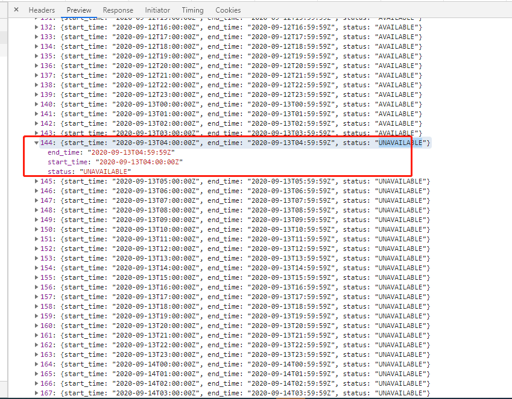

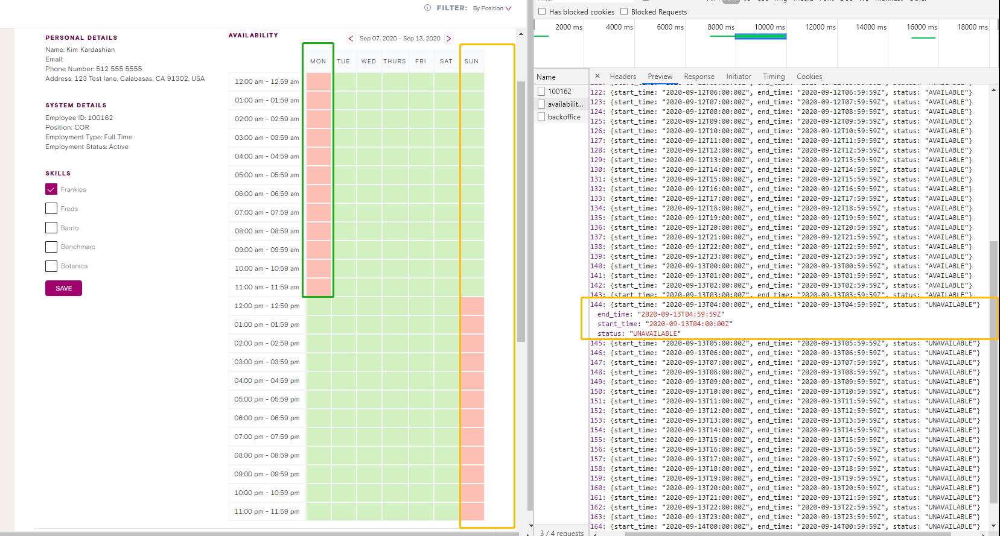


查询的是美东时区，展示的是北京时区

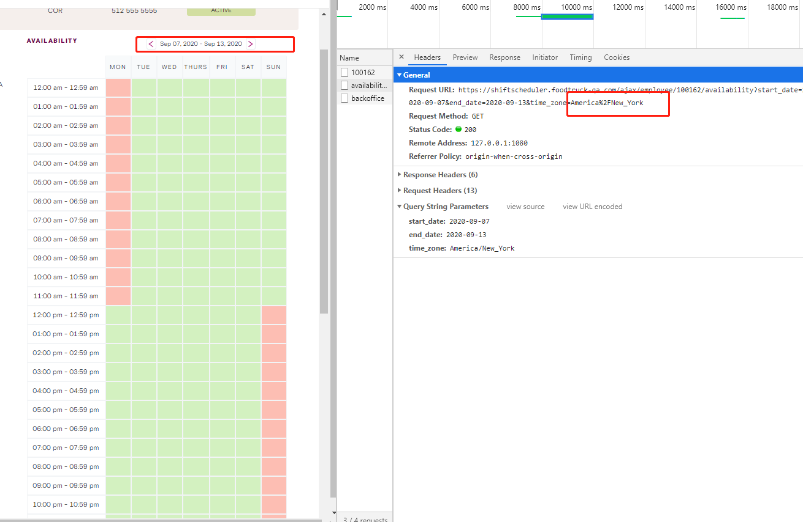


‘(dayforce.assets/image-20200910001423552.png)


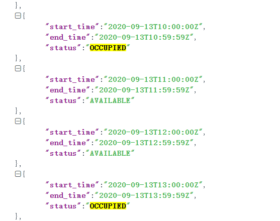

# 异常

74768695F97409C4DA0A

## com.google.gson.JsonSyntaxException

```
app: dayforce*  and action: "topic:dayforce-api-request" and error_code: "com.google.gson.JsonSyntaxException"
```

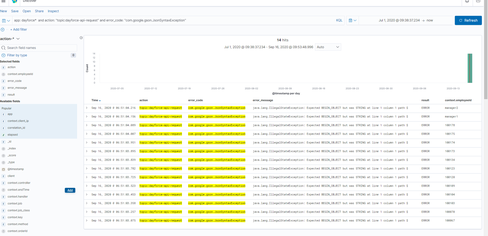

# sql

## 时间函数

### DateTimeFromParts

https://docs.microsoft.com/en-us/azure/cosmos-db/sql-query-datetimefromparts


## 查找某个时间范围内的shift

```
select * from shifts c where c.startTime >= DateTimeToTimestamp("2020-09-10T16:00:00Z")
and c.endTime >= DateTimeToTimestamp("2020-10-09T16:00:00Z")

SELECT * FROM shifts c
WHERE c.sessionType = "TRUCK_SESSION"
AND c.startTime >= DateTimeToTimestamp("2020-09-10T00:00+08:00") AND c.endTime <= DateTimeToTimestamp("2020-09-11T00:00+08:00")

```


```


```

# what I change

step 

**一、存储数据工作流程：**

1. 分析dayforce数据，设计测试用例，编写单元测试
2. 解析dayforce官方接口获取到的员工**可用时间**的格式
3. 实现员工可用时间的格式化：将连续的可用时间区间合并成单个时间区间
4. 优化employee_availability 表结构设计，目的：提高表数据的可读性
5. 不在预估范围的工作：
   - 原先获取dayforce官方的 **员工可用时间**的用法是错误的：没有正确处理**返回时间的时区**
   - dayforce官方返回的数据，时间字段定义模糊，没有明确的解释，需要查阅文档和多次试验验证时间的定义
   - cosmos数据库存储时间的约束

二、**提取数据工作流程**：

1. 设计测试用例，编写单元测试，校验获取可用员工逻辑
2. 分析应用到employee_availability 相关的业务
   - 获取可用员工 相关接口
   - 获取指定时间范围内 员工时间分布详情的接口

3. 不在预估范围内：
   - 修复获取员工时间分布详情的接口计算逻辑，重新分析、实现：可用时间条件、不可用时间条件、占用的时间条件
   - cosmos db比较时间的用法 

三、**测试**：

1. 获取可用员工相关接口测试
2. 员工时间分布详情测试
3. dayforce同步时间到本地的测试

总结：

1. 对dayforce项目细节上使用不熟悉，没有明确文档和交接人，处理起来比较花费时间。
2. 对cosmos新数据库的应用不熟悉
3. 在工作上有较多多并行的任务需要同时解决，希望在这方面上能否协调帮忙处理


## 问题描述：truck-service和shift两边 shif数量不匹配


```
mysql 

SELECT id, start_time, status FROM `truck_sessions` 
WHERE delivery_zone_id = "e63e65e6-65b7-4da1-ab25-7bc0b5e61624"
and start_time >= DATE_FORMAT("2020-09-11 16:30:00",'%Y-%m-%d %H:%i:%s') 
and start_time < DATE_FORMAT("2020-09-12 14:35:00",'%Y-%m-%d %H:%i:%s')
and status = "PLANNED" or status ="REMOVE"
order by id; 

=>
5214,5218,5221,5223,5229,5230,5233,5288,5290,5295

["5230","5288","5229","5290","5214","5218","5221","5223","5295","5233"]
```


```
1.
select c.shiftId from truck_sessions c 
where ARRAY_CONTAINS(["5230","5288","5229","5290","5214","5218","5221","5223","5295","5233"],c.id)

=> 
["12ec089b-75a7-47cf-ae98-07ebe1afb8b2","ada27487-673c-498e-9283-4ff4334e6206","8b5ab3b5-fb2f-473b-9ec7-5c7bd7d992e7","20ff75e7-c1b6-4af3-9b32-3005f32a3edb","df71a8fd-871b-4101-9adb-32a92fe1a44b","99cff25d-df89-43e2-9e78-fea397c830f0","19ad9529-6342-4cd5-af26-b86953e6348a","2d12db3f-ab61-4386-9637-bc3cb1fd2c6b","70c651f3-3a59-4caf-a276-ac0a9e87be44","b42bf554-3817-4ae8-af96-2643ab80d14e"]

2. 
select c.id from truck_sessions c 
where ARRAY_CONTAINS( ["12ec089b-75a7-47cf-ae98-07ebe1afb8b2","ada27487-673c-498e-9283-4ff4334e6206","8b5ab3b5-fb2f-473b-9ec7-5c7bd7d992e7","20ff75e7-c1b6-4af3-9b32-3005f32a3edb","df71a8fd-871b-4101-9adb-32a92fe1a44b","99cff25d-df89-43e2-9e78-fea397c830f0","19ad9529-6342-4cd5-af26-b86953e6348a","2d12db3f-ab61-4386-9637-bc3cb1fd2c6b","70c651f3-3a59-4caf-a276-ac0a9e87be44","b42bf554-3817-4ae8-af96-2643ab80d14e"] ,c.shiftId)

=>
	["5214","5218","5221","5223","5229","5230","5233","5288","5290","5295"]   
mysql 5214,5218,5221,5223,5229,5230,5233,5288,5290,5295


```


```
java

{"name":"@startTime","value":1599840000000}
{"name":"@endTime","value":1599926400000}

SELECT c.id FROM  shifts c 
WHERE (c.startTime >= 1599840000000 AND c.startTime < 1599926400000
OR c.startTime <= 1599840000000 AND c.endTime >= 1599840000000)
AND c.status != "CANCELLED"

=>
["20ff75e7-c1b6-4af3-9b32-3005f32a3edb","df71a8fd-871b-4101-9adb-32a92fe1a44b","19ad9529-6342-4cd5-af26-b86953e6348a","52e72f95-0be6-4850-a9b4-96aabf4424c9","46c7610e-9bfc-4304-b8f5-742b818b6d88","2d12db3f-ab61-4386-9637-bc3cb1fd2c6b","70c651f3-3a59-4caf-a276-ac0a9e87be44","12ec089b-75a7-47cf-ae98-07ebe1afb8b2","b42bf554-3817-4ae8-af96-2643ab80d14e","d674fc20-a1d4-41ff-90c9-2f56c8d4fbdb"]

select c.id from truck_sessions c 
where ARRAY_CONTAINS(["20ff75e7-c1b6-4af3-9b32-3005f32a3edb","df71a8fd-871b-4101-9adb-32a92fe1a44b","19ad9529-6342-4cd5-af26-b86953e6348a","52e72f95-0be6-4850-a9b4-96aabf4424c9","46c7610e-9bfc-4304-b8f5-742b818b6d88","2d12db3f-ab61-4386-9637-bc3cb1fd2c6b","70c651f3-3a59-4caf-a276-ac0a9e87be44","12ec089b-75a7-47cf-ae98-07ebe1afb8b2","b42bf554-3817-4ae8-af96-2643ab80d14e","d674fc20-a1d4-41ff-90c9-2f56c8d4fbdb"] ,c.shiftId)

=>["5214","5223","5229","5233","5286","5287","5288","5290","5295"]
mysql 5214,5218,5221,5223,5229,5230,5233,5288,5290,5295


===========================
{"name":"@startTime","value":1599840000000}
{"name":"@endTime","value":1599926400000}

SELECT * FROM shifts c WHERE  c.startTime >= 1599840000000 and c.startTime < 1599926400000 AND c.status !=  "CANCELLED"

=>
["20ff75e7-c1b6-4af3-9b32-3005f32a3edb","df71a8fd-871b-4101-9adb-32a92fe1a44b","19ad9529-6342-4cd5-af26-b86953e6348a","2d12db3f-ab61-4386-9637-bc3cb1fd2c6b","70c651f3-3a59-4caf-a276-ac0a9e87be44","12ec089b-75a7-47cf-ae98-07ebe1afb8b2","b42bf554-3817-4ae8-af96-2643ab80d14e"]

select c.id from truck_sessions c 
where ARRAY_CONTAINS(["20ff75e7-c1b6-4af3-9b32-3005f32a3edb","df71a8fd-871b-4101-9adb-32a92fe1a44b","19ad9529-6342-4cd5-af26-b86953e6348a","2d12db3f-ab61-4386-9637-bc3cb1fd2c6b","70c651f3-3a59-4caf-a276-ac0a9e87be44","12ec089b-75a7-47cf-ae98-07ebe1afb8b2","b42bf554-3817-4ae8-af96-2643ab80d14e"] ,c.shiftId)

=>
5214
5223
5229
5233
5288
5290
5295

相比mysql该时间范围少一下数据
5218
5221
5230

select c.shiftId from truck_sessions c 
where ARRAY_CONTAINS(["5218","5221","5230"],c.id)
=>["ada27487-673c-498e-9283-4ff4334e6206","8b5ab3b5-fb2f-473b-9ec7-5c7bd7d992e7","99cff25d-df89-43e2-9e78-fea397c830f0"]

select * from shifts c 
where ARRAY_CONTAINS(["ada27487-673c-498e-9283-4ff4334e6206","8b5ab3b5-fb2f-473b-9ec7-5c7bd7d992e7","99cff25d-df89-43e2-9e78-fea397c830f0"],c.id)
=>[]

原因：调试阶段产生的脏数据，restaurantSkill不在，创建trucksession 成功后，创建shift失败，已修复
 app: shift*  and action: "topic:truck-session-planned" and context.truckSessionId: "5230"
```


=>["","","","","5286","5287","","",""]
mysql 5214,5218,5221,5223,5229,5230,5233,5288,5290,5295


少

select c.id from truck_sessions c 
where ARRAY_CONTAINS(["5211"," 5212"," 5224"," 5228"," 5239"],c.id)

=>

[

​    {

​        "id": "5211"

​    }

]


```
cosmos

select c.id from shifts c 
where c.startTime >= DatetimeToTimestamp("2020-09-11T16:00:00Z") 
and c.startTime < DatetimeToTimestamp("2020-09-12T16:00:00Z")

=> 
["93a69969-25e0-4b91-b772-d86eecd3280e","20ff75e7-c1b6-4af3-9b32-3005f32a3edb","df71a8fd-871b-4101-9adb-32a92fe1a44b","19ad9529-6342-4cd5-af26-b86953e6348a","2d12db3f-ab61-4386-9637-bc3cb1fd2c6b","70c651f3-3a59-4caf-a276-ac0a9e87be44","12ec089b-75a7-47cf-ae98-07ebe1afb8b2","b42bf554-3817-4ae8-af96-2643ab80d14e"]


select c.id from truck_sessions c 
where ARRAY_CONTAINS(["93a69969-25e0-4b91-b772-d86eecd3280e","20ff75e7-c1b6-4af3-9b32-3005f32a3edb","df71a8fd-871b-4101-9adb-32a92fe1a44b","19ad9529-6342-4cd5-af26-b86953e6348a","2d12db3f-ab61-4386-9637-bc3cb1fd2c6b","70c651f3-3a59-4caf-a276-ac0a9e87be44","12ec089b-75a7-47cf-ae98-07ebe1afb8b2","b42bf554-3817-4ae8-af96-2643ab80d14e"], c.shiftId)
order by c.shiftId 

=>
5214
5233
5223
5288
5290
5219
5295
5229 


select c.id ,TimestampToDateTime( c.startTime) st, TimestampToDateTime(c.endTime) et  from shifts c where c.id = "93a69969-25e0-4b91-b772-d86eecd3280e"

=>
[
  {
        "id": "93a69969-25e0-4b91-b772-d86eecd3280e",
        "st": "2020-09-12T07:30:00.0000000Z",
        "et": "2020-09-13T05:20:00.0000000Z"
    }
]


```


truckservice 数据没问题

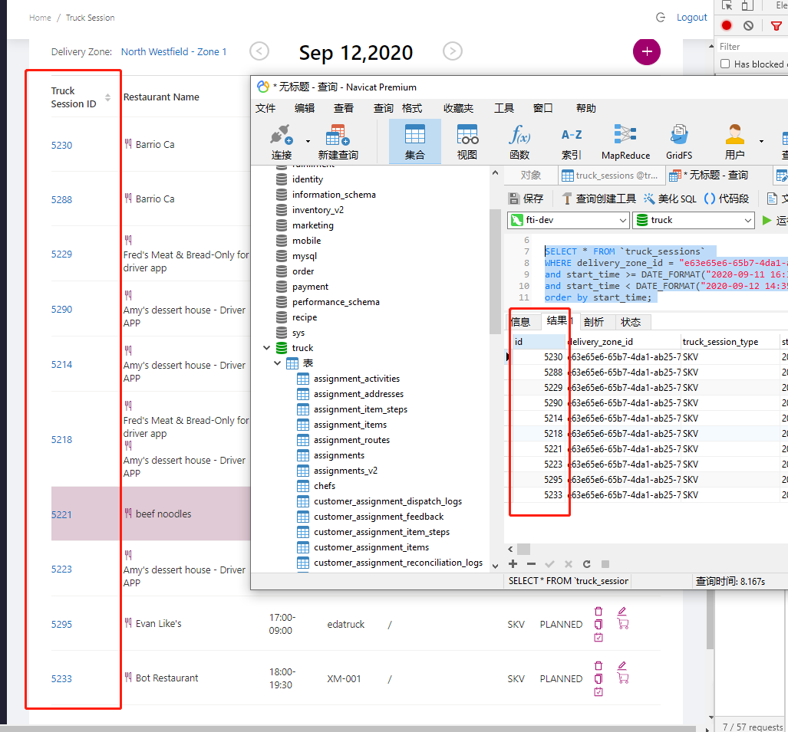

### cosmos 跨表查询

#### count

```
-- example
SELECT VALUE  COUNT(1) FROM truck_sessions c  


```


```
select  c.id sessionId, s.id shiftId  from truck_sessions c join shifts s on c.shiftId = s.id

SELECT VALUE  COUNT(1) FROM truck_sessions c  
=> 83

SELECT VALUE  COUNT(1) FROM shifts c  
=>83

	
```


# 问题

## 问题描述：truck-service与shift-scheduler数据不匹配的原因

1. 代码调试阶段创建trucksession时，数据同步失败；丢失的数据有：？？？
2. ui界面调用的获取展示数据的接口 内部代码实现逻辑有问题 ：筛选数据的时间比较公式错误；
3. 

```
1.1
SELECT value c.shiftId FROM truck_sessions c
=>


1.2
select value c.id from shifts c where c.id not in ("..","..") 
=> 
[
    "d674fc20-a1d4-41ff-90c9-2f56c8d4fbdb",
    "43bb2b4f-5bb9-40ed-bd91-c21cf4b4a432",
    "26fc089f-e850-459e-9e80-1768f838495e"
]

结果：有shift，找不到对应的trucksession

2.1
SELECT value c.id FROM shifts c  

2.2
select value c.shiftId from truck_sessions c  where c.shiftId not in (....)
=>
[
    "785c66b9-304a-4491-a351-23822b65fc74",
    "6904defc-1e8d-48a8-abca-1ef52c582e0c",
    "2f8bdda8-34fe-4208-b978-e4bf77c329f4",
    "6420fa7e-ae0a-4f49-a2d4-b99e0ed4056b",
    "a267ba12-c789-453d-8185-3901b04ca15a",
    "d0872b68-8cde-4c04-b41a-63d9dffa7540",
    "627dbbe3-cbd6-4665-9749-819e5678f103",
    "b0f370dc-e4f9-4ea8-b58a-a4fb71783d48",
    "fb9cfd57-cc07-4b30-832b-905337d122fc",
    "ea1334c2-7b4b-47df-ae1d-2d307a0ec15f",
    "eeeb9a77-29ed-4b8c-9233-5a158c2a5006",
    "9dea1911-8b45-41a8-9973-e631362cfea3"
]

2.3
select value c.id  from truck_sessions c  where c.shiftId not in ()
=>
[
    "5207",
    "5208",
    "5209",
    "5210",
    "5211",
    "5212",
    "5213",
    "5215",
    "5220",
    "5224",
    "5226",
    "5228",
    "5352" 
]

结果：有trucksession 没有shift

```


## sprint0917

http://120.77.208.172:8080/browse/FT-8235

```
SELECT * FROM c
WHERE c.startTime >= @startTime and c.startTime < @endTime
AND c.status != "CANCELLED"
```


```
SELECT * FROM c
WHERE c.startTime >= DateTimeToTimestamp("2020-09-12T00:00:00Z")
AND c.startTime < DateTimeToTimestamp("2020-09-13T00:00:00Z")
AND c.status != "CANCELLED"
 

```

# solver

## 候选worker

```
sql：

```


## 候选shift

```
-- condition：
runSolverDateRange: [x,y]
sessionType = "TRUCK_SESSION"
status = "UNFILLED"
timeRange : x <= shift.startTime and shift.startTime < y
剩余需要分配的员工数 > 0 
remainingMaxCapacity = max(0,shift.maxCapacity-shift.workers.size)  

-- sql:
SELECT * FROM shifts c 
WHERE ( @startTime <= c.startTime AND c.startTime < @endTime ) 
AND c.sessionType = "TRUCK_SESSION" AND c.status = "UNFILLED"
AND c.maxCapacity - ARRAY_LENGTH(c.shiftWorkers) > 0
```


## solver实现员工分配的shift


# 可选员工

```
in shift-scheduler-site layer:
ShiftPageAJAXWebService.findAlternativeWorkers()
ShiftPageAJAXWebService.findAlternativeEmployees()


in shfit-solver-service layer:
BOShiftSolverWebService.getInput()
	getShiftsByTimeRange()
	getTrainingShiftsByTimeRange()
		
        
in shift-scheduler-service layer:
	BOShiftWebService.getShiftsByFilter()
		

```


# 编译异常

​    java.lang.UnsatisfiedLinkError: no jniortools in java.library.path: [lib/windows_64]

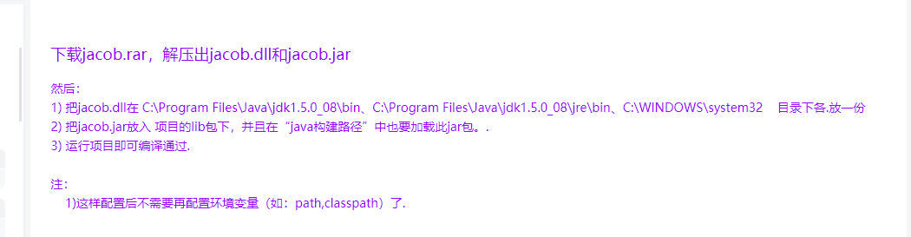


# sql


## findShiftedWorkers：查询指定时间内已经背排班的员工

```
select * from shifts c 
where c.status != "CANCELLED"
and (c.startTime <= @startTime and @endTime <= c.endTime 
or @startTime < c.startTime and c.startTime < @endTime
or @startTime < c.endTime and c.endTime < @endTime
or @startTime < c.startTime and c.endTime < @endTime))

example:
2020-09-15T00:00:00Z
2020-09-16T00:00:00Z
{"name":"@startTime","value":1600128000000}
{"name":"@endTime","value":1600214400000}

select * from shifts c 
where c.status != "CANCELLED"
c.startTime <= DateTimeToTimestamp("2020-09-15T00:00:00Z") and DateTimeToTimestamp("2020-09-16T00:00:00Z") <= c.endTime 
or DateTimeToTimestamp("2020-09-15T00:00:00Z") < c.startTime and c.startTime < DateTimeToTimestamp("2020-09-16T00:00:00Z")
or DateTimeToTimestamp("2020-09-15T00:00:00Z") < c.endTime and c.endTime < DateTimeToTimestamp("2020-09-16T00:00:00Z")
or DateTimeToTimestamp("2020-09-15T00:00:00Z") < c.startTime and c.endTime < DateTimeToTimestamp("2020-09-16T00:00:00Z")

-- 优化
select  * from shifts c 
where c.status != "CANCELLED"
and ( @startTime <= c.startTime and c.startTime < @endTime or  @startTime < c.endTime and c.endTime <= @endTime )

-- example 
select  * from shifts c 
where c.status != "CANCELLED"
and ( DateTimeToTimestamp("2020-09-15T00:00:00Z") <= c.startTime and c.startTime < DateTimeToTimestamp("2020-09-16T00:00:00Z")
or  DateTimeToTimestamp("2020-09-15T00:00:00Z") < c.endTime and c.endTime <= DateTimeToTimestamp("2020-09-16T00:00:00Z"))

-- bug
SELECT * FROM shifts c 
WHERE c.status != "CANCELLED"
AND (DateTimeToTimestamp("2020-09-18T13:00:00Z") <= c.startTime AND c.startTime < DateTimeToTimestamp("2020-09-18T15:25:00Z")
AND  DateTimeToTimestamp("2020-09-18T13:00:00Z") < c.endTime AND c.endTime <= DateTimeToTimestamp("2020-09-18T15:25:00Z"))

select * from shifts c 
where c.status != "CANCELLED" 
and ( c.startTime <= DateTimeToTimestamp("2020-09-18T13:00:00Z") and DateTimeToTimestamp("2020-09-18T15:25:00Z") <= c.endTime 
or DateTimeToTimestamp("2020-09-18T13:00:00Z") < c.startTime and c.startTime < DateTimeToTimestamp("2020-09-18T15:25:00Z")
or DateTimeToTimestamp("2020-09-18T13:00:00Z") < c.endTime and c.endTime < DateTimeToTimestamp("2020-09-18T15:25:00Z")
or DateTimeToTimestamp("2020-09-18T13:00:00Z") < c.startTime and c.endTime < DateTimeToTimestamp("2020-09-18T15:25:00Z"))


-- 查看员工的排班

select c.status ,c.id ,TimestampToDateTime(c.startTime) st, TimestampToDateTime(c.endTime) et from shifts c
where ARRAY_CONTAINS (c.shiftWorkers, { employeeId: "100120" }, true)
```


## availabilitySolverShift：获取可用于参与solver运算的shift

```
-- 获取可排版的shift(truck-session类型)
SELECT * FROM shifts c 
WHERE ( @startTime <= c.startTime AND c.startTime < @endTime ) 
AND c.sessionType = "TRUCK_SESSION" AND c.status = "UNFILLED"

---- example 
SELECT * FROM shifts c 
WHERE ( DateTimeToTimestamp("2020-09-10T00:00:00Z") <= c.startTime 
AND c.startTime < DateTimeToTimestamp("2020-09-11T00:00:00Z") ) 
AND c.sessionType = "TRUCK_SESSION" AND c.status = "UNFILLED"

-- 获取可排版的shift(training-session类型)
SELECT * FROM shifts c 
WHERE ( @startTime <= c.startTime AND c.startTime < @endTime ) 
AND c.sessionType = "TRAINING_SESSION" 
AND c.status != "CANCELLED"

---- example 
SELECT * FROM shifts c 
WHERE ( DateTimeToTimestamp("2020-09-10T00:00:00Z") <= c.startTime 
AND c.startTime < DateTimeToTimestamp("2020-09-17T00:00:00Z")  ) 
AND c.sessionType = "TRAINING_SESSION" 
AND c.status != "CANCELLED"
```


```
{"query":"SELECT *\nFROM c\nWHERE c.employmentStatus = \"ACTIVE\" AND ARRAY_CONTAINS(@employeeIds, c.id) AND c.position = @position"}

{"name":"@employeeIds","value":["100067","100070","100103","100104","100109","100120","100123","100134","100162","manager1","manager2"]}

{"name":"@position","value":"COR"}


SELECT * FROM c WHERE c.employmentStatus = "ACTIVE" AND ARRAY_CONTAINS(["100067","100070","100103","100104","100109","100120","100123","100134","100162","manager1","manager2"], c.id) AND c.position = "COR"


```


# sftp

```
SELECT * FROM c where c.id ="0ff1674d-5a2e-41ea-bb45-49976b4edb6e"


"0ff1674d-5a2e-41ea-bb45-49976b4edb6e",
"32506c1-b502-4ca8-a025-b6902bf0c4f9",
"277a2c63-e0cf-4737-a7aa-ec7de7996b24",
"3ca7e6b2-681d-4e7d-95c9-6cf71bdfc60c",
"42a2258b-b771-4f6d-983a-bd1727282a91"

select * from c where ARRAY_CONTAINS ([0ff1674d-5a2e-41ea-bb45-49976b4edb6e,
132506c1-b502-4ca8-a025-b6902bf0c4f9,
277a2c63-e0cf-4737-a7aa-ec7de7996b24,
3ca7e6b2-681d-4e7d-95c9-6cf71bdfc60c,
42a2258b-b771-4f6d-983a-bd1727282a91],c.id)

```

