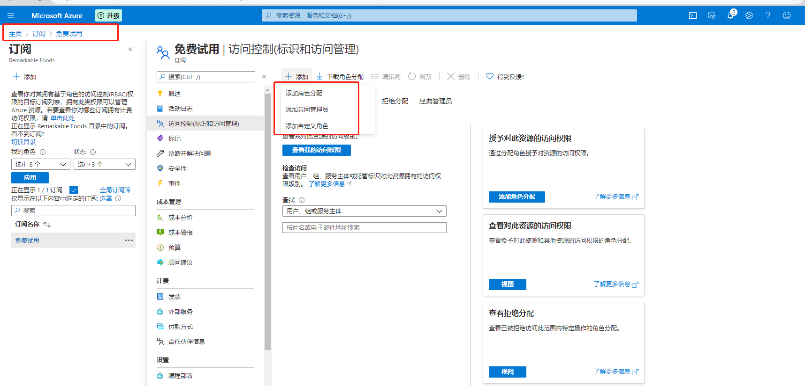
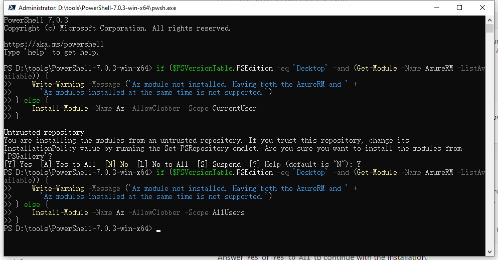
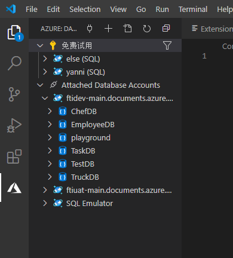
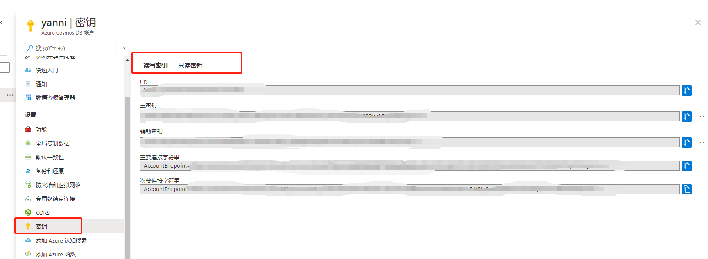
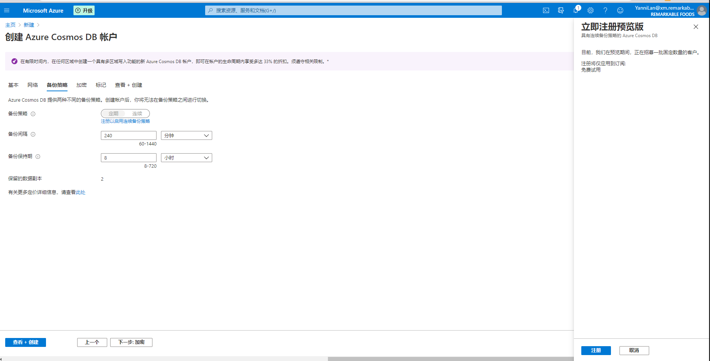
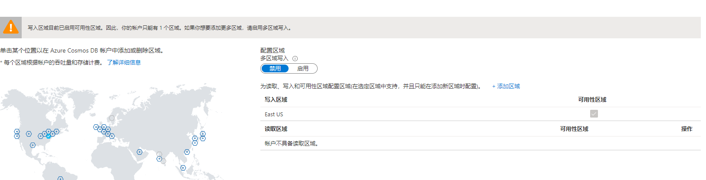

[toc]

```
Account name: localhost:<port>
Account key: C2y6yDjf5/R+ob0N8A7Cgv30VRDJIWEHLM+4QDU5DE2nQ9nDuVTqobD4b8mGGyPMbIZnqyMsEcaGQy67XIw/Jw==
// 8081
```


# 拓展知识点

## 端到端

```
定义：端到端是网络连接，属于传输层。端到端是由无数的点到点实现和组成的。
    端到端建立连接会经过复杂的物理线路，将源和目的之间建立连接，称为逻辑链路；

端到端数据库管理
	
```

## SAAS

- Software-as-a-Service，软件即服务 ，软件应用模式。
- 
- 

## PAAS

- Platform-as-a-Service，平台即服务，把服务器平台作为一种服务提供的商业模式。
- 

## LAAS

- Infrastructure as a Service，基础设施即服务


# 角色访问控制RBAC

- 文档 ：
  - https://docs.microsoft.com/en-us/azure/role-based-access-control/quickstart-assign-role-user-portal
  - https://docs.microsoft.com/en-us/azure/role-based-access-control/check-access



# cosmos可视化管理工具：

1、power bi desktop

2、VS Code (插件（Azure Databases）)

3、

## 1 安装Power BI

登录：主机地址/key

地址：

https://powerbi.microsoft.com/zh-cn/desktop/

https://docs.azure.cn/zh-cn/cosmos-db/powerbi-visualize

使用教程：https://docs.microsoft.com/zh-cn/azure/cosmos-db/powerbi-visualize

## 2  Azure Storage Explorer (choose)

https://docs.microsoft.com/en-us/azure/cosmos-db/storage-explorer

https://azure.microsoft.com/zh-cn/features/storage-explorer/

## 3  安装power shell 7 

3.1 安装power shell 7 

https://docs.microsoft.com/en-us/powershell/scripting/install/installing-powershell?view=powershell-7

3.2  安装 powerShellGet (win10以上已经内置了)

https://docs.microsoft.com/en-us/powershell/scripting/gallery/installing-psget?view=powershell-7

3.3  安装azure power shell

https://docs.microsoft.com/en-us/powershell/azure/install-az-ps?view=azps-4.4.0#code-try-0	



3.4  安装Azure Cosmos DB ODBC驱动

https://docs.microsoft.com/en-us/azure/cosmos-db/odbc-driver

## 4  VS Code (插件(Azure Databases))

- 文档：https://marketplace.visualstudio.com/items?itemName=ms-azuretools.vscode-cosmosdb&ssr=false#overview

- 操作：

  - 例 View  -> Command Palette -> Attach  Databases  Account-> SQL

  - 效果

    

- 功能

  ```
  Features
  Azure Databases Explorer
  Create a database server by clicking the + button in the title
  View database servers and open directly in the portal
  View/Create/Delete databases, collections, graphs, stored procedures, documents, and queries
  Click on a document, stored procedure, or query to open in the editor
  Click on a graph to visualize data
  Query graph using Gremlin
  Edit a document and persist changes to the cloud
  Attach a Mongo server by clicking the plug icon in the title
  ```

## 连接配置

- endpointUri: URI
- 秘钥：主密钥 or 辅助密钥  
- 连接字符串: 主要连接字符串 or 次要连接字符串



# cosmos开发文档

地址：

https://docs.microsoft.com/zh-cn/learn/modules/choose-api-for-cosmos-db/

[https://docs.microsoft.com/zh-cn/learn/modules/create-cosmos-db-for-scale/?WT.mc_id=azureportalcard_Service_Azure%20Cosmos%20DB_-inproduct-azureportal](https://docs.microsoft.com/zh-cn/learn/modules/create-cosmos-db-for-scale/?WT.mc_id=azureportalcard_Service_Azure Cosmos DB_-inproduct-azureportal)


# JAVA应用

构建cosmos应用的Java项目

步骤

1、创建maven项目

2、导入依赖

```
    <dependencies>
        <dependency>
            <groupId>com.azure</groupId>
            <artifactId>azure-cosmos</artifactId>
            <version>4.0.1-beta.1</version>
        </dependency>
        <dependency>
            <groupId>com.github.javafaker</groupId>
            <artifactId>javafaker</artifactId>
            <version>1.0.2</version>
        </dependency>
    </dependencies>
```

3、创建数据库、容器、索引策略

```java
package org.example;

import com.azure.cosmos.ConnectionPolicy;
import com.azure.cosmos.ConsistencyLevel;
import com.azure.cosmos.CosmosAsyncClient;
import com.azure.cosmos.CosmosAsyncContainer;
import com.azure.cosmos.CosmosAsyncDatabase;
import com.azure.cosmos.CosmosClientBuilder;
import com.azure.cosmos.models.CosmosContainerProperties;
import com.azure.cosmos.models.IncludedPath;
import com.azure.cosmos.models.IndexingMode;
import com.azure.cosmos.models.IndexingPolicy;
import com.google.common.collect.Lists;
import reactor.core.publisher.Mono;

import java.util.ArrayList;
import java.util.List;
import java.util.concurrent.atomic.AtomicBoolean;

/**
 * 使用 Java 创建新的 Java 应用、数据库和容器
 */
public class App {
    private static String endpointUri = "YOUR_URI";
    private static String primaryKey = "YOUR_KEY";
    private static String writeLocation = "YOUR_LOCATION";

    private static CosmosAsyncDatabase targetDatabase;
    private static CosmosAsyncContainer customContainer;
    private static AtomicBoolean resourcesCreated = new AtomicBoolean(false);

    public static void main(String[] args) {
        // 1. 添加以下代码行以创建 CosmosAsyncClient 实例：
        ConnectionPolicy defaultPolicy = ConnectionPolicy.getDefaultPolicy();
        defaultPolicy.setPreferredLocations(Lists.newArrayList(writeLocation));

        CosmosAsyncClient client = new CosmosClientBuilder()
            .setEndpoint(endpointUri)
            .setKey(primaryKey)
            .setConnectionPolicy(defaultPolicy)
            .setConsistencyLevel(ConsistencyLevel.EVENTUAL)
            .buildAsyncClient();

        // 2.此代码将检查 Azure Cosmos DB 帐户中是否已存在数据库，如果不存在，它将创建一个数据库。
        client.createDatabaseIfNotExists("Products").flatMap(databaseResponse -> {
            targetDatabase = databaseResponse.getDatabase();
            // 2.1 创建索引策略
            IndexingPolicy indexingPolicy = new IndexingPolicy();
            indexingPolicy.setIndexingMode(IndexingMode.CONSISTENT);
            indexingPolicy.setAutomatic(true);
            List<IncludedPath> includedPaths = new ArrayList<>();
            IncludedPath includedPath = new IncludedPath();
            includedPath.setPath("/*");
            includedPaths.add(includedPath);
            indexingPolicy.setIncludedPaths(includedPaths);
            // 2.2 创建容器
            CosmosContainerProperties containerProperties =
                new CosmosContainerProperties("Clothing", "/productId");
            containerProperties.setIndexingPolicy(indexingPolicy);
            return targetDatabase.createContainerIfNotExists(containerProperties, 10000);
        }).flatMap(containerResponse -> {
            customContainer = containerResponse.getContainer();

            return Mono.empty();
        }).subscribe(voidItem -> {
        }, err -> {
        }, () -> {
            resourcesCreated.set(true);
        });

        while (!resourcesCreated.get()) ;

        System.out.println(String.format("Database Id:\t%s", targetDatabase.getId()));
        System.out.println(String.format("Container Id:\t%s", customContainer.getId()));

        client.close();
    }
}
```


# cosmos核心概念

1、请求单位：

参考：https://docs.microsoft.com/zh-cn/learn/modules/create-cosmos-db-for-scale/3-what-is-a-request-unit

概念：

```
预配吞吐量: 数据库预配吞吐量 、容器预配吞吐量
请求单位：一个请求单位 (1 RU) 等于使用文档 ID 在 1-KB 文档上执行一个 GET 请求所产生的大致成本。
```

2、分区概念

3、cosmos账户结构

- 数据库：数据库包含容器。（）
- 容器： 容器是预配的吞吐量和存储的缩放单元。（相当于mongodb的collection）
- 项：（相当于mongodb的document）

一个 Cosmos DB 帐户包含零个或零个以上的数据库，一个数据库 (DB) 包含零个或零个以上的容器，一个容器包含零个或零个以上的项。


# 分区和分区键

分区的对象：容器 

作用：唯一索引（项的逻辑分区分区键+项ID）

## 相关文档：

https://www.c-sharpcorner.com/article/partitioning-in-cosmos-db/

https://docs.microsoft.com/en-us/azure/cosmos-db/partitioning-overview

https://github.com/Azure/azure-cosmosdb-js-server/edit/master/samples/stored-procedures/bulkDelete.js


## 逻辑分区：

- 分区对象：单个容器
- 定义：将容器中的项分割成不同的子集，称为"逻辑分区"。（逻辑分区由分区键相同的项组成）
- 知识点：
  - 单个容器的逻辑分区数量：没有限制
  - 单个逻辑分区存储的数据大小：0 ~ 20GB

  - 只允许对单个逻辑分区的项执行事务。（存储过程、触发器）
  - 项的分区键值进行哈希处理，得到物理分区地址，最后平均分配物理分区空间
  - 迁移逻辑分区：随着程序的吞吐量 或者 数据存储容量的 增长，会进行物理分区的拆分，从而分散负载。
- 对单个容器进行逻辑分区，(不同的容器间，允许分区的键值一样？)


## 物理分区

- 分区对象：单个容器

- 定义：

  - 通过 跨物理分区 分布 **数据和吞吐量** 来缩放容器。

- 创建：

  - 根据创建容器时设置的预配吞吐量和 存储容量，创建物理分区由系统内部实现，完全由cosmos DB 管理。

- 容器的物理分区数量跟以下的配置有关：

  - 预配吞吐量. (每个单独的物理分区 每秒最多可以处理10000个RU.)
  - 数据存储容量. (每个单独的物理分区最大可以存放50GB的数据)

- 知识点：

  - 物理分区和逻辑分区的关系：一个或者多个逻辑分区可以映射到一个物理分区（物理分区：逻辑分区 = 1：n）
  - 无数量限制：容器中的物理分区总数没有限制。
  - 自动扩建：当容器的预配置吞吐量或者总存储容量增长的时候，会自动创建新的物理分区，会拆分旧物理分区，并建立新的物理分区到 逻辑分区 的映射。
  - **单个逻辑分区**的数据存放在**同一块**物理分区内。
  - “热分区”（逻辑分区）：容器的预配吞吐量由被**平均分配**到每个物理分区。如果分区键设计不合理，将导致大量的请求被定向到某个逻辑分区内，从而形成“热分区”，会导致请求频率受限和高花费。

- 副本集

  - 一个物理分区由一个副本集组成。
  - 单个副本集（or物理分区）：1个leader 、2个follower、 1个forwarder。
  - 作用：
    - 保证物理分区的数据具有 持久性、高可用性和一致性。
  
  - 可拓展：分区集（https://docs.microsoft.com/en-us/azure/cosmos-db/global-dist-under-the-hood）

- 物理分区的拆分

  - 预配吞吐量导致

    ```
    条件: 单个物理分区的预配吞吐量 > 10000 RU/s
    拆分过程：
    假设有A、B、C 三个逻辑分区，同时映射到物理分区P1，当满足预配吞吐量 > 10000 RU/s时，拆分物理分区结果如下：？？？
    	结果1：p1(A,B), p2(C)
    	结果2：p1(A), p2(B), p3(C)
    	等
    小结：由于单个逻辑分区的数据只能被存放到同一个物理分区，且每个物理分区有cosmos系统管理，所以不知道具体怎么实现？
    ```

  - 存储容量导致

    ```
    例子1：(新增物理分区) 
    条件: 单个物理分区的存储总量 > 50GB
    拆分过程：
    假设有A、B、C 三个逻辑分区，同时映射到物理分区P1，当满足存储总量>50GB时，拆分物理分区结果如下：？？？
    	结果1：p1(A,B), p2(C) 等情况
    
    例子2：（减少物理分区）	
    条件：
       
    	
    ```

  - 小结：

    ```
    由于单个逻辑分区的数据只能被存放到同一个物理分区，且每个物理分区有cosmos系统管理，所以不知道具体怎么实现，只知道当单个物理分区预配吞吐量or存储容量 超过（低于）会对拆分（合并）物理分区
    ```

- 小结：

  - 例子：

    ```
    设当前容器C：
      预设吞吐量 = 18000 RU/s
      物理分区数 = 3个
      逻辑分区 = [LA,LB,LC] （每个物理分区都有3个逻辑分区）
    得：
     单个物理分区的吞吐量= 18000/3 RU/s = 6000 RU/s
     LA、LB、LC逻辑分区共享吞吐量（共享不等于平均）：6000 RU/s
    ```

  - 结论：

    ```
    如果设置的分区键，能够使得逻辑分区之间平均消耗吞吐量，那么能确保物理分区之间的吞吐量保持消耗平衡。
    ```


## 逻辑分区和物理分区的关系

- 映射关系： 一个或者多个逻辑分区可以映射到一个物理分区（物理分区：逻辑分区 = 1：n）

## 分区键

- 组成：分区键路径 和分区键值

- 分区键路径：由 "/"+项的属性组成

- 分区键值：可以是字符串 或者 数值类型

- 特点：

  - **分区键不可变**：选择分区键后，将无法就地更改它。（如果需要更改分区键，则应使用所需的新分区键将数据移动到新容器中。）
  - **分区键值不可变**：项初始化完成后，分区键的键值不可变更（如果没有给分区键赋值，后续也不能再赋值，如果已经赋值，那么该值不可修改）。
  - **作用域**：所有基于JavaScript的存储过程和触发器的作用域 仅限于**单个逻辑分区**。

- 一个容器可以设置的分区键数量：1个

- 分区键的选择

  - 大多数情况下如何选择分区键：

    ```
    - 分区键值不可变。
    - 分区键的键值不可变，且值域广。
    - 可以使得逻辑分区均分容器的吞吐量和存储容量。
    ```

  - 重读取型容器如何选择分区键：

    ```
    - 经常被用作谓词查询条件的属性（等值查询or范围查询）可以被设置为分区键
    
    如果容器的吞吐量 > 3000 RU/s 或 容器的存储容量 > 100GB 
    那么：考虑跨物理分区问题
    否则：不考虑跨物理分区问题
    ```

  - 使用项 ID 作为分区键

    ```
    优点：
    值 唯一且范围广
  可以均分容器的吞吐量和存储容量
    可以用作点读（查询速度快 且 低成本）
    对于有多个物理分区的大容器，查询高效
    
    缺点
    值不能重复；
    不能设置事务（在单个项做事务没有意义，事务是通过触发器或存储过程等实现）
    
    ```
    

  


```
举例
项：{"id":"1", "name":"a"}
分区键路径：/name
分区键值：a

什么时候选用项ID作为分区键：
项ID具有业务含义,且需要经常被应用到的时候，像员工表的员工Id
```


# 预设吞吐量

https://docs.microsoft.com/en-us/azure/cosmos-db/set-throughput

- 操作对象：容器、数据库
- 设置方式：自动伸缩预配吞吐量模式、 手动配置预配吞吐量模式

##  自动伸缩方式

- 容器数： 最多25个
- 吞吐量：400RU/s ~ unlimited 

## 手动方式

- 容器数：最多25个
- 吞吐量：400RU/s ~ 4000RU/s

## 吞吐量设置方式比较

|                          | 手动on DB              | 自动缩放on DB          | 手动on container   | 自动缩放on container     |
| ------------------------ | ---------------------- | ---------------------- | ------------------ | ------------------------ |
| 预配吞吐量范围           | 400 ~ 100,000 RU/s     | 400 ~ 4000 RU/s        | 400 ~ 100,000RU/s  | 4000 ~ unlimited RU/s    |
| 容器数                   | 最多25个               | 最多25个               | -                  | -                        |
| 特定容器可分配的RU数     | 不确定，取决于多种因素 | 不确定，取决于多种因素 | 取决于容器预设大小 | 取决于容器预设弹性大小？ |
| 容器存储大小             | unlimited              | unlimited              | unlimited          | unlimited                |
| 单个逻辑分区的最大吞吐量 | 10K RU/s               | 10K RU/s               | 10K RU/s           | 10K RU/s                 |
| 单个逻辑分区的最大存储量 | 20 GB                  | 20 GB                  | 20 GB              | 20 GB                    |
| 最低预配吞吐量           | 400RU/s                | 400RU/s                | 400RU/s            | 400RU/s                  |
|                          |                        |                        |                    |                          |


# 请求单位RU

文档：https://docs.microsoft.com/zh-cn/azure/cosmos-db/optimize-cost-reads-writes#measuring-the-ru-charge-of-a-request

- 定义：进行数据库操作所需要的成本。

- 作用：用来度量处理数据库操作时 **消耗的CPU、IO、内存资源** 所需要的成本。

- 数据库操作：

  - 读取： 点读（在单个项或者分区上查找键或值？？？） 、查询
  - 写入：插入、替换、删除、更新

- 读取计费方式（以下读取操作消耗的RU从低到高）

  - 点读（同时指定分区键和项ID构造查询语句）
  - 指定单个分区键构造查询语句
  - 查询子句没有指定任何分区，且不包含等式查询或者范围查询条件
  - 没有任何查询条件。

- 查询优化

  - 建容器时，合并多个实体（类似于合并shift表和truck session表）
  - 降低查询的复杂性（谓词的使用：数量、性质？，源数据集大小？？？）

- 写入计费方式

  - 写入项的大小

  - 写入的数据中包含索引类型的属性数量 

  - 批量写入可以优化RU的消耗

  - 注：

    ```
    Inserting a 1 KB item with less than 5 properties to index costs around 5 RUs. Replacing an item costs two times the charge required to insert the same item.
    
    ```

  -- upsert 操作需要的RU数 是insert 的两倍

    ```
  
    ```

- 优化写入

  - 大项目写入azure blob 存储
  - 优化索引策略

# 降低成本

## 优化预配吞吐量


## 优化请求成本


# JAVA批处理

https://docs.microsoft.com/en-us/azure/cosmos-db/bulk-executor-java


# 相关概念

- 来源：https://azure.microsoft.com/zh-cn/support/legal/sla/cosmos-db/v1_3/?cdn=disable

```
SLA: 全面的服务水平协议
“容器” 指数据项容器，以及事务和查询的规模单位。
“消耗的 RU 数”是指在指定的一秒内 Azure Cosmos DB 容器处理的所有请求 所消耗的请求单位的总数。
“请求单位 (RU)”是 Azure Cosmos DB 吞吐量的度量。
```

高可用性、高吞吐量、低延迟以及可调的一致性。


# NoSQL 数据库与关系数据库之间的差别

## 高吞吐量

分布式数据 可以提供更可伸缩的解决方案。

## 分层数据


# 优势

## 速度

服务级别的速度和吞吐量；

快速的全局访问

即使弹性：弹性地缩放存储和吞吐量


## 简化应用开发


## 高可用性、安全性、 一致性

- **一致性**：
  - 通过自动数据复制轻松地将数据分布到任何 Azure 区域。 使用强一致性时，多区域写入或 RPO 0 无需停机。

- **安全性**：
  -  基于角色的访问控制，供精细的控制 ，确保数据安全；
  -  自行管理的密钥？？？
- **高可用性**：
  - 提供了全面的 [SLA](https://azure.microsoft.com/support/legal/sla/cosmos-db) 套件？？？


# Cosmos DB 资源模型

一个数据库账户 可以管理多个数据库；

一个数据库就可以创建多个容器；


## 数据库

- 数据库是一组cosmos容器的管理单元
- 增删改查数据库的方式：SQL API 等
- 

## 容器

- 容器是 **预配的吞吐量** 和 **存储** 的缩放单元。

- 容器可以提供几乎无限的预配吞吐量 (RU/s) 和存储。

- 容器的层次结构：存储过程、合并过程、函数、触发器、项

- 根据选用的cosmos API类型，容器可以是集合、表、图、等（同理，项可以是行、文档、节点等）

- 创建容器时，配置吞吐量：

  - **专用预配吞吐量模式**（可弹性缩放）：创建容器的时候预配。
  - **共享预配吞吐量模式**（可以弹性缩放）：共享数据库的的吞吐量。（"共享吞吐量" 容器不包含已配置的专用预配吞吐量的容器）

- 注：（只有在创建数据库和容器时，才能配置共享吞吐量和专用吞吐量。 若要在创建容器后从专用吞吐量模式切换为共享吞吐量模式（或反之），必须创建一个新容器，并将数据迁移到该容器。 可以使用 Azure Cosmos DB 更改源功能迁移数据。）

- 容器的属性

  - 系统属性：

    ```
    _rid: 容器的唯一标识符	
    _etag:用于乐观并发控制的实体标记	
    _ts:容器上次更新的时间戳	
    _self: 容器的可寻址 URI	
    ```

  - 用户可配置属性：

    ```
    id: 用户定义的容器唯一名称	
    indexingPolicy: 提供更改索引路径、索引类型和索引模型的功能	
    TimeToLive: 提供在设置的时间段后从容器自动删除项的功能 有关详细信息，请参阅生存时间。	
    changeFeedPolicy: 用于读取对容器中的项所做的更改。 有关详细信息，请参阅更改源。	
    uniqueKeyPolicy: 用于确保逻辑分区中一个或多个值的唯一性。 有关详细信息，请参阅唯一键约束。	
    
    ```

- TTL （见：https://docs.microsoft.com/en-us/azure/cosmos-db/time-to-live）

  

## 项

- 项的属性：

  - 系统自动生成：

  ```
  _rid: 项的唯一标识符	
  _etag: 用于乐观并发控制的实体标记	
  _ts: 项上次更新的时间戳	
  _self: 项的可寻址 URI	
  ```

  - 可以有系统自动生成 或 用户自定义（ID的值）

  ```
  id: 逻辑分区中用户定义的唯一名称。	
  （id 属性的唯一性仅在每个逻辑分区中强制实施。 多个文档可以具有相同的id属性，但具有不同的分区键值。）
  ```

  - 用户自定义属性：

  ```
  任意用户定义的属性	
  ```

  

  

# 事务

- 原文档：https://docs.microsoft.com/en-us/azure/cosmos-db/database-transactions-optimistic-concurrency#multi-item-transactions
- 作用域：单个逻辑分区内的项
- 实现方式：注册 存储过程、合并过程、UDF、触发器
- 实现语言：JavaScript
- 事务级别：快照隔离级别

# 计费模式

- 原文档：https://azure.microsoft.com/zh-cn/pricing/details/cosmos-db/

- 在线计费：https://azure.microsoft.com/zh-cn/pricing/calculator/?service=bandwidth

- 计费相关：

  - 资源的容量模式
  - 数据库的总存储量（数据和索引）

- 容量模式分类：

  - 预配吞吐量模式（手动、自动缩放）

  - 无服务模式

    ```
  预配吞吐量模式（Provisioned Throughput）
      手动预配吞吐量模式（Standard Provisioned Throughput）
      自动缩放吞吐量模式（Autoscale Provisioned Throughput）
    
    无服务模式（Serverless）
      按需处理流量突发，无需资源规划和管理
      （也就是不能对数据库和容器的吞吐量进行手动或者自动配置）
    
    ```
  
- 备份策略

  - 默认副本数：2个（免费，>2的副本数需要额外收费）
  
- 
  
- 

  



## 预配吞吐量成本计算

- 分类：
  - 手动预配吞吐量
  - 自动缩放预配吞吐量

### 手动预配吞吐量

- 容器 or 数据库

  ```
  单区域写入
  每个小时内，预配100RU/s,消费成本 0.008 $/h.
  每个小时内，预配1RU/s,  消费成本 0.00008 $/h.
  1 monthly = 730 hours.
  
  例子1
  容器A：手动预配吞吐量 = 400 RU/s
  成本预计：
  每个小时成本预计= 400 * 0.00008 = 400 / 100 * 0.008 = 0.032 $/h
  每天成本预计= 24 * 400 *0.00008 = 24 * 400 / 100 * 0.008 = 0.768 $/d
  每个月成本预计 = 730 * 400 * 0.00008 =730 *  400 / 100 * 0.008 = 23.36 $/m
  
  ```

  

### 自动缩放预配吞吐量

- 容器 or 数据库

  - 单区域写入

  ```
  单区域写入
  预配100RU/s,每小时消费成本 0.012$；即 0.012$/h.
  预配1RU/s,每小时消费成0.00012$;即 0.00012$/h.
  1 monthly = 730 hours.
  
  例子1：
  
  容器A: 设置自动缩放预配吞吐量 = 4000 RU/s
  自动缩放范围：400 ~ 4000 RU/s (最小值为最大值的10%)
  成本范围预计：
  每个小时预计成本范围：(0.048 ~ 0.48)$/h
  min: 400*0.00012  = 400/100*0.012  = 0.048 $/h
  max: 4000*0.00012 = 4000/100*0.012 = 0.48 $/h
  
  每天预计成本范围：(1.152 ~ 11.52)$/d
  min: 24*400*0.00012  = 24*400/100*0.012  = 1.152 $/d
  max: 24*4000*0.00012 = 24*4000/100*0.012 = 11.52 $/d
  
  每月成本范围：(35.04 ~ 350.4)$/m
  min: 730*400*0.00012  = 730*400/100*0.012  = 35.04 $/m
  max: 730*4000*0.00012 = 730*4000/100*0.012 = 350.4 $/m
  
  结果：成本取决于 每个小时内 预计的成本范围内的最大值
  ```

  - 单区域写入 (启用可用性区域）

    【注：具有可用性的单区域只能在创建资源的时候启用】

    ```
    单区域写入 (启用可用性区域）
    
    ```

  

  - 单区域写入（跨多个区域）

    ```
    
    ```

    

  - 多区域写入（跨多个区域）

    ```
    
    ```

    

## 存储成本计算

- 


# 区域配置相关

## 单区域写入


## 具有可用性区域的单区域写入


## 跨N个区域的单区域写入


## 跨N个区域的多区域写入


# 存储分类

- 分类 
  - 事务存储
  - 分析存储
- 关系
  - 两者独立存储，事务存储是传统的行式存储，分析存储是列式存储
  - 
  - 

## 事务存储（transactional store）

- 即：行式存储
- 

## 分析存储（Analytical store ）

- 即：列式存储（见：https://docs.microsoft.com/en-us/azure/cosmos-db/analytical-store-introduction）
- 操作对象：容器
- 作用：
  - 用于大数据集进行分析查询，可降低查询成本

- 定义：
  - 分析存储无需分配单独的请求单位 (RU)，
  - 自动同步：完全托管功能给 Azure Cosmos DB ， 对操作数据执行的插入、更新、删除将准实时**自动**从事务存储**同步**到分析存储。

- 优点：
  - 解决了传统ETL管道出现的复杂性和延迟问题。
  - 提高查询的响应时间

- 注意点
  - 任意级别属性个数超过200个时，不进行分析存储。
  - 文档嵌套深度大于等于5级时，不进行分析存储。
  - 字段名大小写不敏感，全部转为小写进行
- 启用方式
  - 手动触发，非默认（见：https://docs.microsoft.com/en-us/azure/cosmos-db/configure-synapse-link#create-analytical-ttl）
- Analytical TTL
  - 0 or null            :   不会进行分析存储
  - -1 s（default）:   保留所有历史数据，包含在事务存储中过期的数据
  - n  s                     :   事务存储中最后一次修改的时间到n秒后过期
- 


# TTL

- 操作对象：容器Container、项Item、分析存储Analytical store
- 文档：https://docs.microsoft.com/en-us/azure/cosmos-db/time-to-live
- 优先级：
  - 容器有启用TTL： 项TTL > 容器TTL > ?
- 

## 容器TTL

- 单位：秒s
- 值
  - off (null): 无自动过期时间限制
  - -1: 永不过期
  - n（非0）：指定容器的过期时间
- 设置TTL
  - https://docs.microsoft.com/en-us/azure/cosmos-db/how-to-time-to-live?tabs=dotnetv2%2Cjavav4

## 项TTL


## 分析存储TTL

