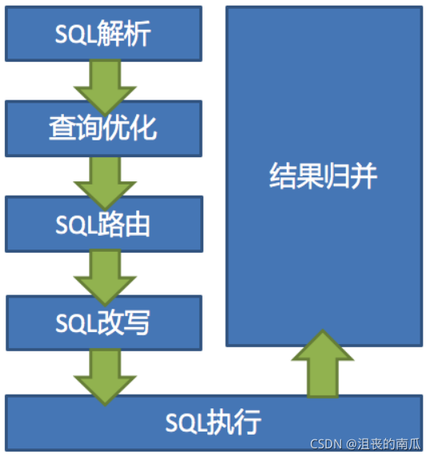
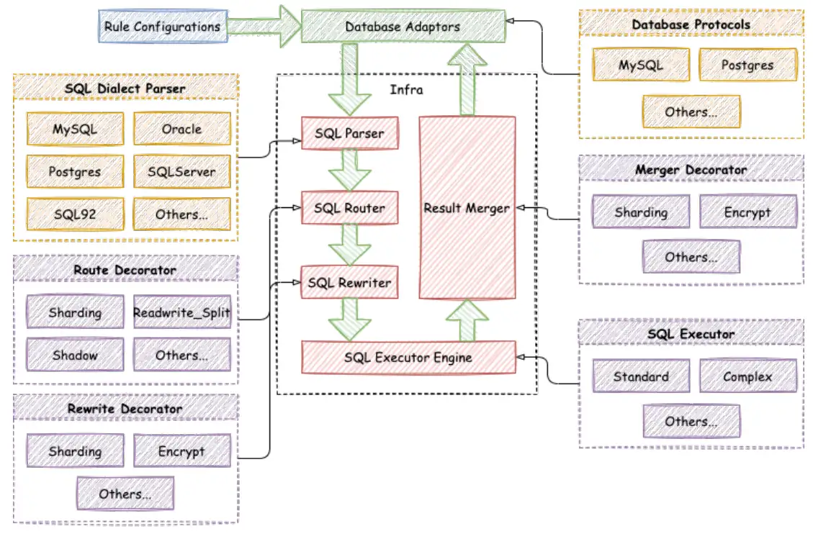

# 数据分片

## 背景

随着公司业务快速发展，数据库中的数据量猛增，传统的数据库存储方案可能无法满足快速增长的数据量和高并发查询的需求。在单表存储所有数据的情况下，数据库的性能可能会受到瓶颈限制，例如查询效率下降、响应时间延长、维护难度也会增加等。

并且关系型数据库本身比较容易成为系统瓶颈，单机存储容量、连接数、处理能力都有限。当单表的数据量达到1000W或100G以后，由于查询维度较多，即使添加从库、优化索引，做很多操作时性能仍下降严重。

即使通过提升服务器硬件能力来提高数据处理能力，比如增加存储容量、CPU等，这种方案成本很高，如果瓶颈在MySQL本身，那么提高硬件也是有限的。

因此，期望通过以数据分片为手段，应对大量数据的存储和查询需求，以提高数据库系统的性能、可用性和扩展性。

## 目的

数据分片，即分库分表，分为水平分库、水平分表、垂直分库、垂直分表四种方式

分库是指将一个大的数据库（单个MySQL实例）按照一定的规则拆分成多个小的数据库，每个小的数据库可以部署在不同的物理服务器上。

分库的目的主要有两点，一是为了将数据分散存储，降低单个数据库的数据量和压力；二是为了将不同的业务分开处理，提高系统的可扩展性和稳定性。

分表是指将大表按照一定的规则拆分成多个小表，每个小表可以存放相同结构的一部分数据，从而减小单张表的数据量和压力。

分表的主要目的是为了提高查询效率和写入速度。

## 优点 

**提高数据库性能**

分库分表可以将数据分散存储在多台服务器上，从而提高数据库的读写性能和响应速度。它可以降低单个数据库的负载压力，减少数据库的死锁和阻塞等问题。

 **降低单库压力**

随着业务的发展，单个数据库的存储容量和性能很容易被耗尽。通过分库分表，可以将数据分散存储在多个数据库和表中，从而降低单个数据库的压力，避免数据库性能瓶颈的出现。

**提高数据安全性**

通过分库分表，可以将不同的数据存储在不同的数据库和表中，从而提高数据的安全性。

## 缺点

**复杂性增加**

由于分库分表需要将数据分散存储在多个数据库和表中，因此会增加系统的复杂性。需要考虑如何合理划分数据，并实现数据的分散存储和访问。

同时，在开发和维护过程中需要考虑更多的分布式系统问题，如数据一致性、事务处理、容错机制等。


 **跨库事务处理困难**

由于分库分表将数据分散存储在多个数据库和表中，因此跨库事务处理会变得更加困难。需要考虑如何实现分布式事务，确保数据的一致性和完整性。同时，还需要考虑如何处理分布式事务的性能和可靠性问题。


 **数据迁移和扩容挑战**

由于分库分表将数据分散存储在多个数据库和表中，因此在数据迁移和扩容时会面临一些挑战。需要考虑如何平滑地将数据从一个节点迁移到另一个节点，并确保数据的完整性和一致性。同时，在扩容时还需要考虑如何调整数据划分规则，并重新分配数据到新节点上。

在扩容时，还需要考虑如何重新划分数据，并将数据分配到新节点上。需要考虑数据划分规则的调整和数据分布的均衡等问题。如果数据划分规则和分配策略不当，可能会导致数据倾斜和数据访问性能下降等问题。


## 面临的挑战

- 跨节点事务处理困难：由于数据被分散存储在多个节点上，跨节点事务处理仍然是一个难点。
- 数据迁移和扩容困难：尽管自动化管理可以减少手动操作，但在实际操作中，数据迁移和扩容仍然是一个挑战。
- 复杂性增加：分库分表会增加系统的复杂性，需要考虑更多的分布式系统问题，如数据一致性、事务处理和容错机制等。

# 实现技术

## Sharding-JDBC

### 简介

ShardingSphere-JDBC是一款开源的分布式数据库中间件，也是一个轻量级的Java框架，在Java的JDBC层提供附加服务。客户端直接连接数据库，以jar的形式提供服务，不需要额外的部署和依赖。它可以认为是 JDBC 驱动程序的增强版，完全兼容 JDBC 和各类 ORM 框架。

- 适用于任何基于 JDBC 的 ORM 框架，如 JPA、Hibernate、Mybatis、Spring JDBC Template，或直接使用 JDBC；
- 支持任意第三方数据库连接池，如DBCP、C3P0、BoneCP、HikariCP；
- 支持任何类型的 JDBC 标准数据库：MySQL、PostgreSQL、Oracle、SQLServer 以及任何 JDBC 适配的数据库。
- ShardingSphere还提供了多种数据源的连接方式，包括JDBC、RPC、HTTP等，能够适应不同的场景需求。
- ShardingSphere提供了分库分表、读写分离、分布式事务等功能，可以帮助开发者快速构建高性能、高可用的分布式系统。

**官网：**

https://shardingsphere.apache.org/ 

数据分片：

https://shardingsphere.apache.org/document/current/en/features/sharding/ 

https://shardingsphere.apache.org/document/current/en/user-manual/shardingsphere-jdbc/ 

https://shardingsphere.apache.org/document/current/en/dev-manual/sql-parser/ 

https://shardingsphere.apache.org/document/current/en/reference/sharding/ 

数据迁移：

https://shardingsphere.apache.org/document/current/en/reference/migration/ 

https://shardingsphere.apache.org/document/current/en/user-manual/shardingsphere-proxy/migration/ 


### 水平分片

#### 核心概念

真实表、逻辑表、数据节点、绑定表、广播表、分片键、分片算法、分片策略https://shardingsphere.apache.org/document/current/en/features/sharding/concept/ 

**真实表：**数据库中真实存在的物理表。例如 t_order_0, t_order_1

**逻辑表：**在分片之后，同一类表结构的名称（总成）。例如t_order

**数据节点:** 在分片之后，由数据源和数据表组成。例如ds_0.t_order_0

**绑定表：**指的是分片规则一致的关系表（主表、子表），例如t_order和t_order_item，均按照order_id分片，则此两个表互为绑定表关系。绑定表之间的多表关联查询不会出现笛卡尔积关联，可以提升关联查询效率。

**广播表：**在使用中，有些表没必要做分片，例如字典表、省份信息等，因为他们数据量不大，而且这种表可能需要与海量数据的表进行关联查询。广播表会在不同的数据节点上进行存储，存储的表结构和数据完全相同。

**分片键：**用于分片的数据库字段，是将数据库(表)水平拆分的关键字段。SQL中如果无分片字段，将执行全路由，性能较差。 除了对单分片字段的支持，ShardingSphere也支持根据多个字段进行分片。

**分片算法：**通过分片算法将数据分片，支持通过=、BETWEEN和IN分片。目前提供4种分片算法：精确分片算法、范围分片算法、复合分片算法、Hint分片算法。由于分片算法和业务实现紧密相关，因此并未提供内置分片算法，而是通过分片策略将各种场景提炼出来，提供更高层级的抽象，并提供接口让应用开发者自行实现分片算法。

**分片策略：**包含分片键和分片算法，由于分片算法的独立性，将其独立抽离。真正可用于分片操作的是分片键 + 分片算法，也就是分片策略。目前提供5种分片策略：标准分片策略、复合分片策略、行表达式分片策略、Hint分片策略、不分片策略。对于分片策略存有数据源分片策略和表分片策略两种维度的配置


#### 核心执行流程

当Sharding-JDBC接受到一条SQL语句时，会陆续执行 SQL解析 => 查询优化 => SQL路由 => SQL改写 => SQL执行 => 结果归并 ，最终返回执行结果。

- SQL解析：分为词法解析和语法解析。 先通过词法解析器将SQL拆分为一个个不可再分的单词。再使用语法解析器对SQL进行理解，并最终提炼出解析上下文。 解析上下文包括表、选择项、排序项、分组项、聚合函数、分页信息、查询条件以及可能需要修改的占位符的标记。
- 执行器优化：合并和优化分片条件，如OR等。
- SQL路由：根据解析上下文匹配用户配置的分片策略，并生成路由路径。目前支持分片路由和广播路由
- SQL改写：将SQL改写为在真实数据库中可以正确执行的语句。SQL改写分为正确性改写和优化改写
- SQL执行：通过多线程执行器异步执行。
- 结果归并：将多个执行结果集归并以便于通过统一的JDBC接口输出。结果归并包括流式归并、内存归并和使用装饰者模式的追加归并这几种。






#### **SQL使用规范**

**支持的SQL使用规范**

- 路由至单数据节点时，目前MySQL数据库100%全兼容。
- 路由至多数据节点时，全面支持DQL、DML、DDL、DCL、TCL。支持分页、去重、排序、分组、聚合、关联查询（不支持跨库关联）。
- 完全支持MySQL和Oracle的分页查询，SQLServer由于分页查询较为复杂，仅部分支持。

**不支持的SQL使用规范**

- 不支持CASE WHEN、HAVING、UNION (ALL)
- 支持分页子查询，但其他子查询有限支持，无论嵌套多少层，只能解析至第一个包含数据表的子查询，一旦在下层嵌套中再次找到包含数据表的子查询将直接抛出解析异常。


#### Q&A

由于数据存储在不同的库和表中，也带来了其他方面的一些问题，如下：

- ID主键怎么生成？
- 数据怎么保持一致？
- 数据库怎么扩容？
- 分页排序、事务问题、跨表跨库join问题等。

##### **ID主键怎么生成？**

- UUID： 32 位的字符串。它的存储以及查询对 MySQL 的性能消耗较大，而且 MySQL 官方也明确建议，主键要尽量越短越好，作为数据库主键 UUID 的无序性还会导致数据位置频繁变动，严重影响性能。
- **SNOWFLAKE：**（雪花算法）是默认使用的主键生成方案，生成一个 64bit 的长整型（Long）数据。由 4 部分组成，1bit 符号位、41bit 时间戳位、10bit 工作进程位以及 12bit 序列号位。雪花算法 是一种严重依赖于服务器时间的算法，而依赖服务器时间的就会遇到一个棘手的问题：时钟回拨。
- **自定义**主键生成算法：https://mp.weixin.qq.com/s/0RBeWV-any_Rb9JbVPvcfw 

##### 数据怎么保持一致？

Sharding-JDBC 通过两种方式来保证数据的一致性：分布式事务和强一致性算法。

- **分布式事务**

分布式事务是指由多个分布式数据库操作组成的一个事务，确保这些操作要么全部成功，要么全部失败。Sharding-JDBC 支持的分布式事务包括 XA 和 BASE 协议。其中，XA 协议是一种经典的两阶段提交协议，保证所有数据库的操作要么全部提交，要么全部回滚。BASE 协议是一种基于最终一致性的协议，在处理分布式事务时允许部分节点的操作成功，但最终会通过补偿机制将数据达到一致状态。

- **强一致性算法**

除了分布式事务，Sharding-JDBC 还采用了强一致性算法来保证数据的一致性。具体来说，Sharding-JDBC 使用了 Paxos 或 Raft 等一致性算法。这些算法通过选举、复制和日志等机制来确保数据在多个节点之间的一致性。无论节点是否发生故障，这些算法都能保障数据的强一致性。

根据 CAP 理论，任何分布式系统无法同时满足一致性（Consistency）、可用性（Availability）和分区容错性（Partition tolerance）三个要求。Sharding-JDBC 在实现数据一致性时，需要在这三个要求之间进行权衡。

Sharding-JDBC 默认采用 CP 模型，保证数据的一致性和分区容错性，而在可用性方面有一定的牺牲。当数据库节点发生故障时，Sharding-JDBC 会自动切换到其他可用节点，保证系统的高可用性。

然而，在某些场景下，对可用性要求较高的应用可能需要选择 AP 模型。Sharding-JDBC 也提供了相应的配置，允许用户在一定程度上牺牲一致性以换取更高的可用性。

Sharding-JDBC 通过分布式事务和强一致性算法来保证数据的一致性。同时，在一致性级别上提供了默认的 CP 模型和可调整的 AP 模型，以满足不同应用的需求。使用 Sharding-JDBC，开发人员可以轻松地实现数据分片，并保证数据在分片之间的一致性。

### **优点：**

- 易于集成和使用：Sharding-JDBC 提供了简单易用的接口，通过配置文件即可实现数据库的水平拆分和分库分表。不需要修改现有的应用程序代码，只需稍微调整数据库连接配置即可实现分片功能。
-  高性能：Sharding-JDBC 在实现上采用了多种优化策略，如连接池复用、异步执行等，以加速查询和操作的处理速度。它还支持数据库连接的读写分离，有效减轻数据库服务器的负载压力，提高系统的整体性能。
- 可扩展性：通过使用 Sharding-JDBC，可以将数据库水平拆分到多个节点上，每个节点负责处理一部分数据。这样，随着数据量和负载的增加，可以简单地添加更多的节点来扩展数据库性能和存储容量。此外，Sharding-JDBC 还支持动态分片功能，即可以在运行时根据实际需求动态添加、删除和调整分片规则。
- 数据一致性和容错性：Sharding-JDBC 提供了多种数据分片策略，如基于范围、哈希、精确等方式，以确保数据在各个分片之间的分布均匀。它还支持事务的跨分片操作，保证了数据的一致性。同时，为了防止单个节点的故障对整个系统产生影响，Sharding-JDBC 支持将数据复制到多个节点上以增加容错性。
- 易于管理和维护：
- 通过使用 Sharding-JDBC，可以将数据库的管理和维护工作分散到各个分片节点上，降低了管理的复杂性。同时，Sharding-JDBC 还提供了详细的监控和日志功能，方便运维人员进行故障排查和性能调优。

### **缺点：**

- 复杂性：使用Sharding-JDBC进行数据分片需要对数据库进行重新设计，包括数据拆分、分片键选择等。这对于原本没有进行分片设计的项目来说，会增加很多工作量和复杂性。
- 性能损失：由于Sharding-JDBC需要将数据拆分到多个数据库中，因此在进行查询时需要访问多个数据库。这可能会导致查询性能的损失，特别是在跨分片的情况下。
- 事务管理：由于Sharding-JDBC将数据分布到多个数据库中，因此在跨分片事务的处理上存在一些挑战。具体来说，跨分片事务需要借助分布式事务管理器来保证数据的一致性和原子性，这会增加系统的复杂性。
- 数据迁移和故障恢复：当需要对数据库进行扩容或故障恢复时，涉及到数据的迁移和同步操作。Sharding-JDBC并没有提供官方的数据迁移和故障恢复工具，这将增加了相应工作的难度。

### 结论

1. Sharding-JDBC 是一个功能强大且易于使用的数据库分片中间件，它大大简化了分布式系统中的数据库管理和维护工作，提高了系统的性能、可伸缩性和容错性。
2. Sharding-JDBC虽然提供了丰富的功能来支持大规模数据分片和扩展，但同时也带来了一些额外的复杂性和性能损失。因此，在选择和使用Sharding-JDBC时需要权衡其功能和缺点，根据实际情况进行合理的选择。

### 性能测试

#### **语法格式**

```
${begin..end} 表示范围区间 

${[unit1, unit2, unit_x]} 表示枚举值 
```

例子

```
${['online', 'offline']}_table${1..3} 

$->{['online', 'offline']}_table$->{1..3} 
```

结果

```
online_table1, online_table2, online_table3, 

offline_table1, offline_table2, offline_table3 
```

**数据节点配置**

- 均匀分布的数据节点**：**db${0..1}.b_order${1..2} 
- 不均匀分布的数据节点：db0.b_order${0..1},db1.b_order${2..4}


#### 在web项目中集成sharding-jdbc

1. 搭建web项目 【SpringBoot 3.2.3+ MyBatisPlus 3.5.5 + ShardingSphere-JDBC 5.4.0 + Hikari+ MySQL 8.0.33】([git@github.com](mailto:git@github.com):SWE15041/Sharding.git)
2. 配置分片策略（分片键+分片算法） ，场景如下：

- 1库1表新增、查询、更新
- 1库2表新增、查询、更新
- 2库各2表新增、查询、更新

1. 测试